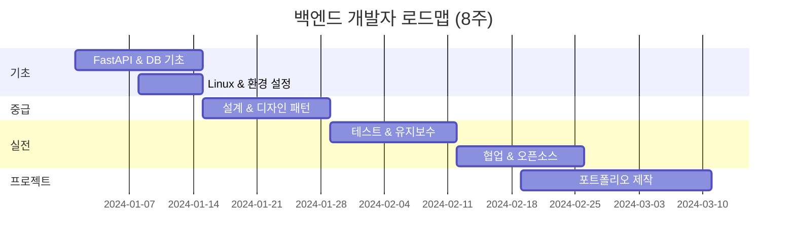

# 📚 백엔드 개발자 학습 가이드 전체 목차

**환영합니다!** 이 가이드는 백엔드 개발자가 되기 위한 완벽한 로드맵입니다.

---

## 🎯 학습 목표

- ✅ FastAPI로 실전 백엔드 API 개발
- ✅ 데이터베이스 설계 & 최적화
- ✅ 테스트 & 유지보수
- ✅ 협업 & 오픈소스 기여

---

## 📖 학습 순서

### 1단계: 기초 다지기

#### [study.md - FastAPI & 백엔드 기초](./study.md)
- HTTP, WSGI/ASGI, 비동기
- 데이터베이스 기본 (테이블, 스키마, 쿼리)
- ERD 다이어그램
- Agile/Scrum 방법론
- FastAPI, Pydantic, SQLAlchemy

**학습 시간**: 1-2주

---

#### [study1.md - Linux & 개발 환경](./study1.md)
- Linux 필수 명령어
- 프로그래밍 언어 선택 (Python, Go, Node.js 비교)
- OS 선택 (Ubuntu, Alpine)
- 문제 정의 방법

**실습 코드**:
- Linux 명령어 자동화 Python 스크립트
- 환경 설정 자동화

**학습 시간**: 1주

---

### 2단계: 설계 & 아키텍처

#### [study2.md - 설계 프로세스 & 디자인 패턴](./study2.md)
- API 설계 (RESTful)
- DB 스키마 설계 & 정규화
- ERD, Sequence Diagram, Class Diagram
- 디자인 패턴:
  - Singleton
  - Factory
  - Repository
  - Dependency Injection
- 3계층 아키텍처 (Controller → Service → Repository)

**실습 코드**:
- 디자인 패턴 Python 구현
- 완전한 3계층 아키텍처

**학습 시간**: 2주

---

### 3단계: 실전 개발

#### [study3.md - 테스트 & 유지보수](./study3.md)
- 테스트:
  - Unit Test (pytest)
  - Integration Test
  - E2E Test (Playwright)
  - Mock & Stub
- 로깅 & 모니터링 (Sentry)
- 성능 최적화
- CI/CD (GitHub Actions)

**실습 코드**:
- pytest 테스트 작성
- GitHub Actions 워크플로우
- 성능 프로파일링

**학습 시간**: 2주

---

### 4단계: 협업 & 오픈소스

#### [study4.md - 협업 & 오픈소스](./study4.md)
- Git 협업 워크플로우
- Pull Request & 코드 리뷰
- 오픈소스 라이선스 (MIT, GPL, Apache)
- 한국 개발자 문화
- 취업 & 면접 준비

**실습 코드**:
- Git 협업 실습
- 오픈소스 기여

**학습 시간**: 1-2주

---

## 🚀 프로젝트 코드 파일

현재 FastAPI 프로젝트의 모든 파일에는 **교육용 주석**이 있습니다:

### 핵심 파일
- [`main.py`](./main.py) - 앱 시작점, import 라이브러리 설명
- [`controller/test.py`](./controller/test.py) - POST/GET API 완벽 가이드
- [`models/database.py`](./models/database.py) - DB 연결
- [`models/models.py`](./models/models.py) - ORM 모델
- [`models/schemas.py`](./models/schemas.py) - Pydantic 검증

각 파일의 `[STUDY]` 주석을 따라가며 학습하세요!

---

## 📊 전체 학습 로드맵



---

## 🎓 학습 방법

### 1일 학습 루틴

```
1. 이론 (30분)
   └─ study 파일 읽기

2. 실습 (1시간)
   └─ 코드 직접 작성

3. 복습 (30분)
   └─ 주석 읽으며 이해

4. 프로젝트 (선택)
   └─ 개인 프로젝트에 적용
```

---

## 💡 추가 리소스

### 공식 문서
- [FastAPI 공식 문서 (한글)](https://fastapi.tiangolo.com/ko/)
- [Python 공식 문서](https://docs.python.org/3/)
- [SQLAlchemy 문서](https://docs.sqlalchemy.org/)

### 유튜브
- [코딩애플](https://www.youtube.com/@codingapple)
- [노마드 코더](https://www.youtube.com/@nomadcoders)

### 커뮤니티
- [FastAPI Discord](https://discord.gg/VQjSZaeJmf)
- [Reddit r/FastAPI](https://www.reddit.com/r/FastAPI/)

---

## ✅ 체크리스트

- [ ] study.md - 기본 개념 이해
- [ ] study1.md - Linux & 환경 설정
- [ ] study2.md - 설계 & 디자인 패턴
- [ ] study3.md - 테스트 & 유지보수
- [ ] study4.md - 협업 & 오픈소스
- [ ] 개인 프로젝트 완성
- [ ] 오픈소스 기여 1건
- [ ] 포트폴리오 제작

---

**시작하기**: [study.md](./study.md)를 열어서 공부를 시작하세요! 🚀
