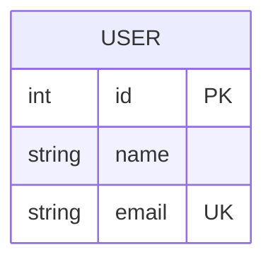
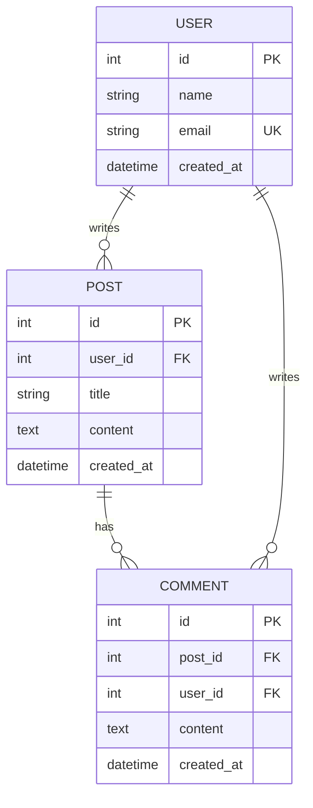
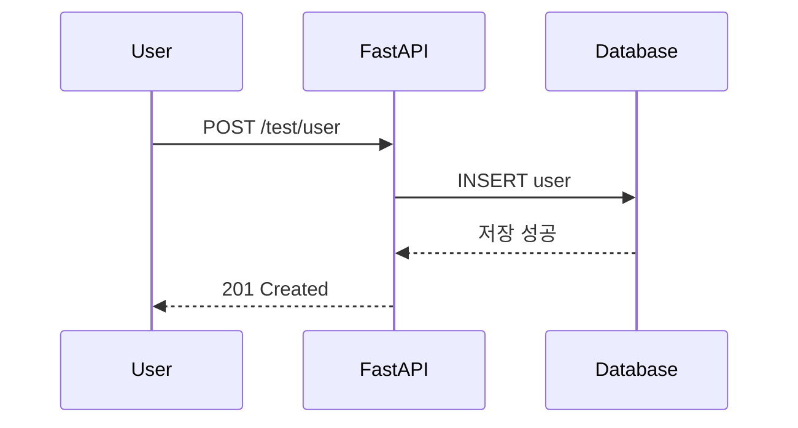
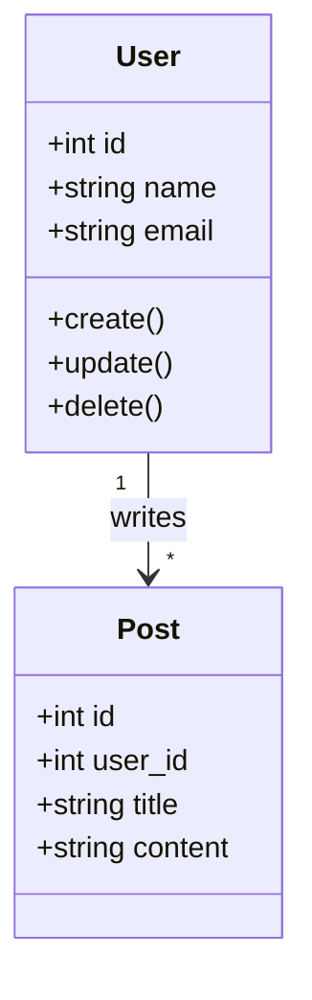
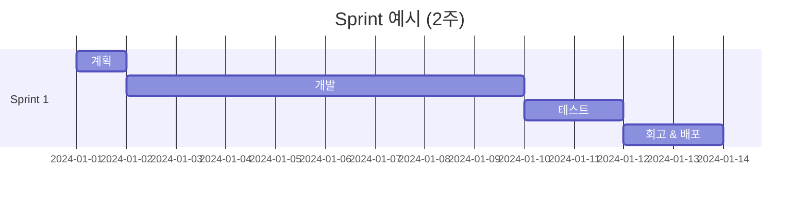
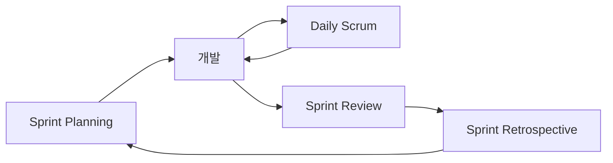

# 📘 FastAPI & 백엔드 개발자 완벽 가이드 (Ultimate Backend Study Guide)

**이 문서의 목표**: 백엔드 개발의 탄탄한 기초를 다지고, 모든 개념을 처음부터 끝까지 이해하기.

---

## 📖 목차 (Table of Contents)

1. [웹 개발 필수 기초 지식](#-0-웹-개발-필수-기초-지식)
2. [데이터베이스 다이어그램](#-1-데이터베이스-다이어그램)
3. [학습 로드맵](#-2-학습-로드맵-study-roadmap)
4. [코드 상세 분석](#-3-코드-상세-분석-code-deep-dive)
5. [소프트웨어 공학 & 아키텍처](#-4-소프트웨어-공학--아키텍처-architecture)
6. [Agile/Scrum 개발 방법론](#-5-agilescrum-개발-방법론)
7. [협업과 DevOps](#-6-협업과-devops-collaboration--devops)
8. [라이브러리 레퍼런스](#-7-라이브러리-레퍼런스)
9. [실전 코드 패턴](#-8-실전-코드-패턴-practical-patterns)
10. [추천 학습 자료](#-9-추천-학습-자료-learning-resources)

---

## 🌐 0. 웹 개발 필수 기초 지식

백엔드를 하기 전에 **꼭 알아야 할 개념**들입니다.

### 💬 HTTP (Hyper Text Transfer Protocol)

브라우저와 서버가 대화하는 규칙입니다.

**주요 메서드**:
- `GET`: 데이터 조회
- `POST`: 데이터 생성
- `PUT`: 데이터 전체 수정
- `DELETE`: 데이터 삭제

**상태 코드**:
- `200 OK`: 성공
- `201 Created`: 생성 성공
- `400 Bad Request`: 잘못된 요청
- `401 Unauthorized`: 인증 필요
- `404 Not Found`: 없음
- `500 Internal Server Error`: 서버 에러

📚 **더 알아보기**: [HTTP 가이드](https://developer.mozilla.org/ko/docs/Web/HTTP)

---

### 🔄 WSGI vs ASGI

**WSGI (Web Server Gateway Interface)**:
- 전통적인 방식, 동기 처리만
- 예: Django, Flask

**ASGI (Asynchronous Server Gateway Interface)**:
- 비동기 처리 가능
- 여러 요청 동시 처리
- 예: FastAPI, Starlette

📚 **더 알아보기**: [ASGI 문서](https://asgi.readthedocs.io/)

---

### ⚡ 비동기 프로그래밍 (Async/Await)

```python
# 동기 - 순차 실행 (총 8초)
def make_coffee(): brew_coffee()  # 5초
def make_tea(): brew_tea()  # 3초

# 비동기 - 동시 실행 (총 5초)
async def make_coffee(): await brew_coffee()
async def make_tea(): await brew_tea()
```

**언제?**: DB 조회, API 호출, 파일 I/O

📚 **더 알아보기**: [Async IO](https://realpython.com/async-io-python/)

---

### 🗄️ 데이터베이스 기본 개념

#### 1. 테이블 구조

```
users 테이블 예시:
┌────┬──────────┬───────────────────┬─────┐
│ id │ name     │ email             │ age │
├────┼──────────┼───────────────────┼─────┤
│ 1  │ 홍길동   │ hong@example.com  │ 25  │
│ 2  │ 김철수   │ kim@example.com   │ 30  │
└────┴──────────┴───────────────────┴─────┘
```

- **Primary Key (기본 키)**: 각 행을 유일하게 식별 (id)
- **Foreign Key (외래 키)**: 다른 테이블 참조
- **Index (인덱스)**: 검색 속도 향상
- **Unique**: 중복 불가

#### 2. 스키마 (Schema)

DB의 설계도입니다.

```sql
CREATE TABLE users (
    id INT PRIMARY KEY,
    name VARCHAR(50),
    email VARCHAR(100) UNIQUE
);
```

#### 3. 세션 (Session)

DB와의 대화 시간입니다.

```python
session = SessionLocal()
user = session.query(User).first()
session.close()  # 필수!
```

#### 4. 쿼리 (Query)

DB에게 명령하는 것입니다.

```sql
SELECT * FROM users WHERE age >= 18;
```

```python
# ORM
session.query(User).filter(User.age >= 18).all()
```

#### 5. 트랜잭션 (Transaction)

여러 작업을 하나로 묶습니다.

```python
try:
    session.add(withdraw(a, 100))
    session.add(deposit(b, 100))
    session.commit()  # 모두 성공
except:
    session.rollback()  # 하나라도 실패하면 취소
```

**ACID 원칙**:
- **A**tomicity: 전부 성공 or 전부 실패
- **C**onsistency: 규칙 준수
- **I**solation: 간섭 없음
- **D**urability: 영구 보존

📚 **더 알아보기**:
- [SQL 기초](https://opentutorials.org/course/3885)
- [DB 정규화](https://d2.naver.com/helloworld/553494)

---

## 📊 1. 데이터베이스 다이어그램

데이터베이스 구조를 **시각적으로** 이해하는 것이 중요합니다.

### ERD (Entity Relationship Diagram)

ERD는 테이블과 그 관계를 보여줍니다.

#### 현재 프로젝트 ERD



**설명**:
- `PK`: Primary Key (기본 키)
- `UK`: Unique Key (중복 불가)

#### 확장 예시: 블로그 시스템



**관계 설명**:
- `||--o{`: 1:N 관계 (한 명의 유저가 여러 게시글)
- `USER writes POST`: 유저가 게시글을 작성
- `POST has COMMENT`: 게시글이 댓글을 가짐

#### 다이어그램 종류

**1. ERD (Entity Relationship Diagram)**:
- 테이블 간의 관계

**2. Sequence Diagram (시퀀스 다이어그램)**:


**3. Class Diagram (클래스 다이어그램)**:


📚 **도구**:
- [dbdiagram.io](https://dbdiagram.io/) - ERD 그리기
- [Mermaid Live Editor](https://mermaid.live/) - 다이어그램 테스트
- [Draw.io](https://app.diagrams.net/) - 다용도 다이어그램

---

## 🚀 2. 학습 로드맵 (Study Roadmap)

### 순서대로 공부하기

1. **`main.py`** → 앱 시작
2. **`controller/items.py`** → 라우팅
3. **`models/schemas.py`** → 데이터 검증
4. **`models/database.py`** → DB 연결
5. **`models/models.py`** → 테이블 정의
6. **`controller/test.py`** → 실전 예제

---

## 📂 2. 코드 상세 분석

### 파일별 스토리라인

1. **시작**: `main.py` → FastAPI 앱 생성 → 라우터 등록
2. **요청**: 사용자가 `/test/user` 접속
3. **라우팅**: `controller/test.py` 실행
4. **검증**: `schemas.py`로 입력 확인
5. **DB**: `models.py`로 저장/조회
6. **응답**: JSON 반환

---

## 🏗️ 3. 소프트웨어 공학 & 아키텍처

### MVC 패턴

- **Model**: 데이터 (`models/`)
- **View**: JSON 응답
- **Controller**: 요청 처리 (`controller/`)

**왜?**: 관심사의 분리 (Separation of Concerns)

### 하이럼의 법칙

> "API 사용자가 많으면, 모든 동작이 사양이 된다"

→ API 변경은 신중하게!

🔗 [하이럼의 법칙](https://www.hyrumslaw.com/)

### OOP (객체 지향)

**4대 원칙**:
1. 캡슐화
2. 상속
3. 다형성
4. 추상화

### SOLID 원칙

1. **S**ingle Responsibility
2. **O**pen/Closed
3. **L**iskov Substitution
4. **I**nterface Segregation
5. **D**ependency Inversion

🔗 [SOLID 쉽게](https://www.nextree.co.kr/p6960/)

---

## 🏃 5. Agile/Scrum 개발 방법론

현대 개발팀의 **표준 작업 방식**입니다.

### 🔄 Agile (애자일)

**의미**: 빠르고 유연하게

**핵심 원칙**:
1. **개인과 상호작용** > 프로세스와 도구
2. **작동하는 소프트웨어** > 문서
3. **고객과의 협력** > 계약 협상
4. **변화에 대응** > 계획 준수

**예시**:
- 폭포수 방식: 6개월 개발 후 분비만 발견
- Agile: 매주 고객 피드백 받으며 수정

---

### 🎯 Scrum (스크럼)

Agile을 구현하는 **구체적인 프레임워크**입니다.

#### 주요 개념

**1. Sprint (스프린트)**:
- **1~4주 단위의 개발 주기**
- 예: 2주 Sprint
  - 월요일: Sprint 시작
  - 화~금: 개발
  - 금요일: Sprint 종료 & 회고



**2. Product Backlog**:
- 해야 할 모든 기능 목록
- 우선순위로 정렬

예시:
```
1. [높음] 로그인 기능
2. [높음] 회원가입
3. [중간] 게시글 작성
4. [낮음] 댓글 기능
```

**3. Sprint Backlog**:
- 이번 Sprint에서 할 일
- Product Backlog에서 선택

**4. Daily Scrum (Stand-up Meeting)**:
- **매일 15분**
- 3가지 질문:
  1. 어제 무엇을 했나?
  2. 오늘 무엇을 할 건가?
  3. 장애물은?

---

#### Scrum 역할

**1. Product Owner (PO)**:
- 제품 책임자
- 무엇을 만들지 결정

**2. Scrum Master**:
- 팀 코치
- 장애물 제거

**3. Development Team**:
- 개발자들
- 실제 개발

---

#### Sprint 흔름



**1. Sprint Planning**:
- 이번 Sprint 목표 정하기
- 시간: 2시간

**2. Daily Scrum**:
- 매일 15분 회의

**3. Sprint Review**:
- 완성한 기능 시연
- 고객 피드백

**4. Sprint Retrospective**:
- 팀 회고
- 무엇을 잘했고, 개선할 점은?

---

### 📋 실전 예시

**2주 Sprint 스케줄**:

| 요일 | 활동 |
|------|------|
| 월 | Sprint Planning (2h) |
| 화-금 | 개발 + Daily Scrum (15m) |
| 금 | 마감 & 테스트 |
| 금 | Sprint Review (1h) |
| 금 | Retrospective (1h) |

**사용 도구**:
- **Jira**: Sprint 관리
- **Trello**: 간단한 칸반보드
- **Linear**: 모던한 대안

🔗 **더 알아보기**:
- [Scrum 가이드](https://www.scrum.org/resources/what-is-scrum)
- [Atlassian Agile](https://www.atlassian.com/agile)

---

## 🤝 6. 협업과 DevOps (Collaboration & DevOps)

### Git & GitHub

**좋은 커밋 메시지**:
- `feat`: 새 기능
- `fix`: 버그 수정
- `docs`: 문서
- `refactor`: 리팩토링

### Docker

```dockerfile
FROM python:3.12
COPY . /app
CMD ["uvicorn", "main:app"]
```

### CI/CD

코드 푸시 → 자동 테스트 → 자동 배포

🔗 [Git 완벽 가이드](https://git-scm.com/book/ko/v2)

---

## 📚 5. 라이브러리 레퍼런스

### FastAPI
```python
app = FastAPI()
router = APIRouter(prefix="/users")
@app.get("/")
def hello(): ...
```

🔗 [FastAPI Docs](https://fastapi.tiangolo.com/)

### Pydantic
```python
class User(BaseModel):
    name: str
    email: EmailStr
```

🔗 [Pydantic Docs](https://docs.pydantic.dev/)

### SQLAlchemy
```python
engine = create_engine("mysql://...")
session.query(User).all()
```

🔗 [SQLAlchemy Docs](https://docs.sqlalchemy.org/)

---

## 🔥 6. 실전 코드 패턴

### Service Layer
```python
class UserService:
    def create_user(self, data):
        # 비즈니스 로직
        ...
```

### Repository Pattern
```python
class UserRepository:
    def get_by_id(self, id):
        return db.query(User).filter(...)
```

---

## 🎓 7. 추천 학습 자료

### 📺 유튜브
- [코딩애플 - FastAPI](https://www.youtube.com/@codingapple)
- [Amigoscode](https://www.youtube.com/watch?v=GN6ICac3OXY)

### 📖 문서 & 블로그
- [FastAPI 공식 문서](https://fastapi.tiangolo.com/ko/)
- [Real Python](https://realpython.com/fastapi-python-web-apis/)

### 💻 깃허브
- [FastAPI Template](https://github.com/tiangolo/full-stack-fastapi-template)
- [Awesome FastAPI](https://github.com/mjhea0/awesome-fastapi)

### 📚 로드맵
- [Backend Roadmap](https://roadmap.sh/backend)

---

**이제 코드 파일로 가서 하나씩 뜯어봅시다! 🚀**
