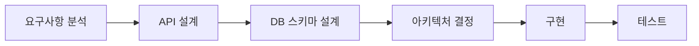
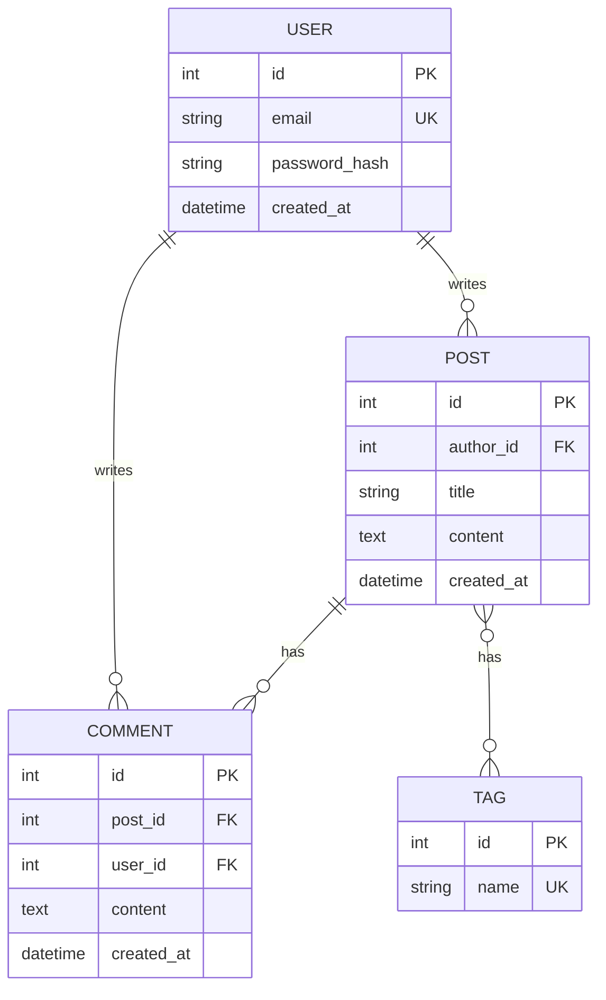
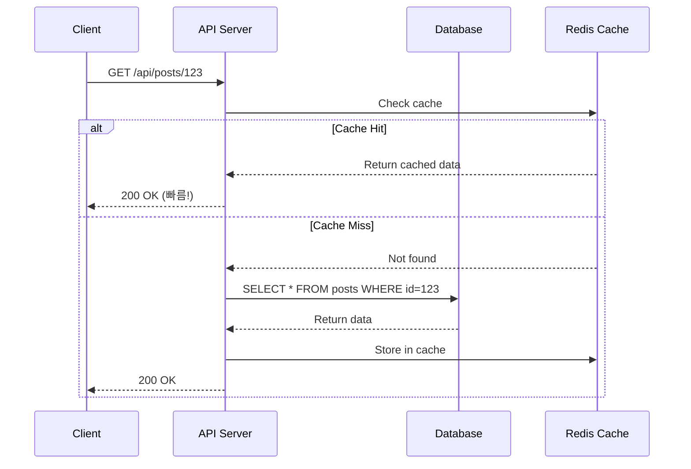

# 📘 Study 2: 설계 프로세스 & 디자인 패턴

**학습 목표**: 확장 가능하고 유지보수 쉬운 백엔드 설계

---

## 📖 목차

1. [설계 프로세스](#1-설계-프로세스)
2. [다이어그램으로 설계하기](#2-다이어그램으로-설계하기)
3. [디자인 패턴](#3-디자인-패턴)
4. [실전 구현 예제](#4-실전-구현-예제)

---

## 1. 설계 프로세스

### 백엔드 설계 단계



#### 1단계: 요구사항 분석

**질문**:
- 누가 사용하나? (사용자 타입)
- 무엇을 하나? (핵심 기능)
- 얼마나 많이? (예상 트래픽)
- 얼마나 빠르게? (성능 요구사항)

**예시**:
```
프로젝트: 블로그 시스템
사용자: 일반 사용자, 작성자, 관리자
주요 기능:
  - 글 작성/수정/삭제
  - 댓글 달기
  - 좋아요
예상 트래픽: DAU 10,000명
성능: 평균 응답 시간 < 200ms
```

#### 2단계: API 설계

**RESTful API 설계 원칙**:

```python
# [올바른 예]
GET    /api/posts          # 글 목록
GET    /api/posts/123      # 특정 글
POST   /api/posts          # 글 작성
PUT    /api/posts/123      # 글 수정
DELETE /api/posts/123      # 글 삭제

# [잘못된 예]
GET /api/getPost?id=123    # ❌ 동사 사용
POST /api/post/delete/123  # ❌ DELETE 써야 함
```

**API 명세서 작성**:

```python
"""
API: 게시글 작성
Method: POST /api/posts
Headers:
  Authorization: Bearer {token}
  Content-Type: application/json

Request Body:
  {
    "title": "제목",
    "content": "내용",
    "tags": ["python", "fastapi"]
  }

Response (201 Created):
  {
    "id": 123,
    "title": "제목",
    "created_at": "2024-01-01T00:00:00Z"
  }

Errors:
  400: 제목이 비어있음
  401: 인증 실패
  500: 서버 에러
"""
```

#### 3단계: DB 스키마 설계

**정규화 (Normalization)**:

```sql
-- [1NF] 반복 그룹 제거
CREATE TABLE posts (
    id INT PRIMARY KEY,
    title VARCHAR(100),
    content TEXT,
    author_id INT,
    tags VARCHAR(255)  -- ❌ 쉼표로 구분된 문자열
);

-- [2NF] 부분 종속 제거
CREATE TABLE posts (
    id INT PRIMARY KEY,
    title VARCHAR(100),
    content TEXT,
    author_id INT
);

CREATE TABLE post_tags (  -- ✅ 별도 테이블
    post_id INT,
    tag_name VARCHAR(50),
    PRIMARY KEY (post_id, tag_name)
);

-- [3NF] 이행 종속 제거
CREATE TABLE users (
    id INT PRIMARY KEY,
    name VARCHAR(50),
    department_id INT  -- ✅ 부서 ID만 저장
);

CREATE TABLE departments (
    id INT PRIMARY KEY,
    name VARCHAR(50)
);
```

**인덱스 설계**:

```sql
-- 자주 조회하는 컬럼에 인덱스
CREATE INDEX idx_posts_author ON posts(author_id);
CREATE INDEX idx_posts_created ON posts(created_at);

-- 복합 인덱스
CREATE INDEX idx_posts_search ON posts(author_id, created_at);
```

---

## 2. 다이어그램으로 설계하기

### ER Diagram (Entity-Relationship)



### Sequence Diagram (시퀀스)



---

## 3. 디자인 패턴

### 1. Singleton (싱글톤)

**언제**: DB 연결, 설정 객체

```python
"""
Singleton Pattern - DB 연결 관리

🔗 참고: https://refactoring.guru/design-patterns/singleton
"""

class DatabaseConnection:
    _instance = None
    
    def __new__(cls):
        """
        __new__: 객체 생성 시 호출
        이미 인스턴스가 있으면 그걸 반환
        """
        if cls._instance is None:
            cls._instance = super().__new__(cls)
            # 실제 DB 연결
            cls._instance.connection = create_engine("mysql://...")
        return cls._instance

# 사용
db1 = DatabaseConnection()
db2 = DatabaseConnection()
assert db1 is db2  # ✅ 같은 객체!
```

### 2. Factory (팩토리)

**언제**: 객체 생성 로직이 복잡할 때

```python
"""
Factory Pattern - 알림 시스템

다양한 알림 방식(이메일, SMS, 푸시)을 통합 관리
"""

from abc import ABC, abstractmethod

# [인터페이스]
class Notification(ABC):
    @abstractmethod
    def send(self, message: str):
        pass

# [구현체들]
class EmailNotification(Notification):
    def send(self, message: str):
        print(f"📧 이메일 발송: {message}")
        # 실제로는 SMTP로 발송

class SMS Notification(Notification):
    def send(self, message: str):
        print(f"📱 SMS 발송: {message}")
        # 실제로는 SMS API 호출

class PushNotification(Notification):
    def send(self, message: str):
        print(f"🔔 푸시 발송: {message}")
        # 실제로는 FCM 등 사용

# [팩토리]
class NotificationFactory:
    @staticmethod
    def create(notification_type: str) -> Notification:
        """
        타입에 따라 적절한 알림 객체 생성
        
        새로운 알림 방식 추가도 쉬움!
        """
        if notification_type == "email":
            return EmailNotification()
        elif notification_type == "sms":
            return SMSNotification()
        elif notification_type == "push":
            return PushNotification()
        else:
            raise ValueError(f"Unknown type: {notification_type}")

# [사용]
def send_notification(user_preference: str, message: str):
    notifier = NotificationFactory.create(user_preference)
    notifier.send(message)

# 예시
send_notification("email", "환영합니다!")
send_notification("push", "새 댓글이 달렸습니다")
```

### 3. Repository (리포지토리)

**언제**: DB 접근 로직 분리

```python
"""
Repository Pattern - 데이터 접근 계층

DB 쿼리를 한 곳에 모아서 관리
🔗 참고: https://martinfowler.com/eaaCatalog/repository.html
"""

from typing import List, Optional
from sqlalchemy.orm import Session
from models import User

class UserRepository:
    """
    User 테이블 전용 Repository
    
    장점:
    1. DB 쿼리 로직을 한 곳에 모음
    2. 테스트 시 Mock 교체 쉬움
    3. 코드 재사용성 증가
    """
    
    def __init__(self, db: Session):
        self.db = db
    
    def find_by_id(self, user_id: int) -> Optional[User]:
        """ID로 유저 찾기"""
        return self.db.query(User).filter(User.id == user_id).first()
    
    def find_by_email(self, email: str) -> Optional[User]:
        """이메일로 유저 찾기"""
        return self.db.query(User).filter(User.email == email).first()
    
    def find_all(self, skip: int = 0, limit: int = 100) -> List[User]:
        """전체 유저 조회 (페이징)"""
        return self.db.query(User).offset(skip).limit(limit).all()
    
    def create(self, user: User) -> User:
        """유저 생성"""
        self.db.add(user)
        self.db.commit()
        self.db.refresh(user)
        return user
    
    def update(self, user: User) -> User:
        """유저 업데이트"""
        self.db.commit()
        self.db.refresh(user)
        return user
    
    def delete(self, user: User) -> None:
        """유저 삭제"""
        self.db.delete(user)
        self.db.commit()

# [Controller에서 사용]
@router.get("/users/{user_id}")
def get_user(user_id: int, db: Session = Depends(get_db)):
    repo = UserRepository(db)
    user = repo.find_by_id(user_id)
    
    if not user:
        raise HTTPException(status_code=404, detail="User not found")
    
    return user
```

### 4. Dependency Injection (의존성 주입)

**언제**: 테스트 가능한 코드 작성

```python
"""
Dependency Injection - 느슨한 결합

🔗 참고: https://fastapi.tiangolo.com/tutorial/dependencies/
"""

# [나쁜 예] - 강한 결합
class UserService:
    def __init__(self):
        self.db = SessionLocal()  # ❌ 직접 생성
        self.cache = Redis()      # ❌ 직접 생성
    
    def get_user(self, user_id):
        # 테스트 시 실제 DB에 접근!
        return self.db.query(User).filter(User.id == user_id).first()

# [좋은 예] - 의존성 주입
class UserService:
    def __init__(self, db: Session, cache: Redis):
        """
        외부에서 주입받음
        테스트 시 Mock 객체로 교체 가능!
        """
        self.db = db
        self.cache = cache
    
    def get_user(self, user_id: int):
        # 캐시 먼저 확인
        cached = self.cache.get(f"user:{user_id}")
        if cached:
            return cached
        
        # DB에서 조회
        user = self.db.query(User).filter(User.id == user_id).first()
        
        # 캐시에 저장
        self.cache.set(f"user:{user_id}", user, ex=3600)
        return user

# [FastAPI에서 사용]
def get_user_service(
    db: Session = Depends(get_db),
    cache: Redis = Depends(get_redis)
) -> UserService:
    return UserService(db, cache)

@router.get("/users/{user_id}")
def get_user(
    user_id: int,
    service: UserService = Depends(get_user_service)
):
    return service.get_user(user_id)
```

---

## 4. 실전 구현 예제

### 완전한 3계층 아키텍처

```python
"""
3-Tier Architecture 구현
Controller → Service → Repository

파일 구조:
project/
├── controller/
│   └── user_controller.py
├── services/
│   └── user_service.py
└── repositories/
    └── user_repository.py
"""

# ============ repositories/user_repository.py ============
from typing import Optional
from sqlalchemy.orm import Session
from models import User

class UserRepository:
    """데이터 접근 계층 (Data Access Layer)"""
    
    def __init__(self, db: Session):
        self.db = db
    
    def find_by_email(self, email: str) -> Optional[User]:
        return self.db.query(User).filter(User.email == email).first()
    
    def create(self, user: User) -> User:
        self.db.add(user)
        self.db.commit()
        self.db.refresh(user)
        return user


# ============ services/user_service.py ============
from passlib.hash import bcrypt

class UserService:
    """비즈니스 로직 계층 (Business Logic Layer)"""
    
    def __init__(self, repository: UserRepository):
        self.repository = repository
    
    def register_user(self, email: str, password: str) -> User:
        """
        회원가입 비즈니스 로직
        
        1. 중복 체크
        2. 비밀번호 해싱
        3. 유저 생성
        """
        # 중복 체크
        existing = self.repository.find_by_email(email)
        if existing:
            raise ValueError("이미 존재하는 이메일입니다")
        
        # 비밀번호 해싱
        hashed_password = bcrypt.hash(password)
        
        # 유저 생성
        user = User(email=email, password_hash=hashed_password)
        return self.repository.create(user)


# ============ controller/user_controller.py ============
from fastapi import APIRouter, Depends, HTTPException
from services.user_service import UserService
from repositories.user_repository import UserRepository

router = APIRouter(prefix="/api/users", tags=["users"])

def get_user_service(db: Session = Depends(get_db)) -> UserService:
    """의존성 주입"""
    repository = UserRepository(db)
    return UserService(repository)

@router.post("/register")
def register(
    email: str,
    password: str,
    service: UserService = Depends(get_user_service)
):
    """
    프레젠테이션 계층 (Presentation Layer)
    
    역할:
    1. HTTP 요청 받기
    2. Service에 위임
    3. HTTP 응답 반환
    """
    try:
        user = service.register_user(email, password)
        return {"id": user.id, "email": user.email}
    except ValueError as e:
        raise HTTPException(status_code=400, detail=str(e))
```

---

## 📚 추가 학습 자료

### 디자인 패턴
- [Refactoring Guru](https://refactoring.guru/design-patterns) - 최고의 디자인 패턴 학습 사이트
- [Design Patterns in Python](https://github.com/faif/python-patterns) - Python 예제

### 아키텍처
- [12 Factor App](https://12factor.net/ko/) - 모던 앱 설계 원칙
- [Clean Architecture](https://blog.cleancoder.com/uncle-bob/2012/08/13/the-clean-architecture.html)

---

**다음 학습**: [study3.md - 테스트, 유지보수, 프로젝트 관리](./study3.md)

## 🎯 오늘의 실습 과제 (Daily Challenges)

### Day 1: ERD 그리기
```python
"""
과제: 블로그 시스템 ERD 직접 그리기

테이블:
1. users (id, email, username)
2. posts (id, user_id, title, content)
3. comments (id, post_id, user_id, content)
4. tags (id, name)
5. post_tags (post_id, tag_id)

도구: dbdiagram.io 사용
"""

# ✍️ 직접 해보기:
# 1. https://dbdiagram.io/ 접속
# 2. 위 테이블 관계 정의
# 3. 스크린샷 저장
```

### Day 2: Repository 패턴 구현
```python
"""
과제: PostRepository 완성하기
"""

from typing import List, Optional
from sqlalchemy.orm import Session
from models import Post

class PostRepository:
    def __init__(self, db: Session):
        self.db = db
    
    # TODO: 아래 메서드들을 구현하세요
    
    def find_by_id(self, post_id: int) -> Optional[Post]:
        """ID로 게시글 찾기"""
        pass  # 여기를 채우세요!
    
    def find_all(self, skip: int = 0, limit: int = 10) -> List[Post]:
        """전체 게시글 (페이징)"""
        pass  # 여기를 채우세요!
    
    def find_by_author(self, author_id: int) -> List[Post]:
        """작성자별 게시글"""
        pass  # 여기를 채우세요!
    
    def create(self, post: Post) -> Post:
        """게시글 생성"""
        pass  # 여기를 채우세요!
    
    def update(self, post: Post) -> Post:
        """게시글 수정"""
        pass  # 여기를 채우세요!
    
    def delete(self, post: Post) -> None:
        """게시글 삭제"""
        pass  # 여기를 채우세요!

# ✍️ 정답 예시는 study2_answers.md에서 확인!
```

### Day 3: Service Layer 구현
```python
"""
과제: 비즈니스 로직을 Service로 분리
"""

from repositories.post_repository import PostRepository

class PostService:
    def __init__(self, repository: PostRepository):
        self.repository = repository
    
    def create_post(self, title: str, content: str, author_id: int):
        """
        게시글 생성 로직
        
        TODO: 아래 검증 로직 추가
        1. 제목은 5자 이상
        2. 내용은 10자 이상
        3. 욕설 필터링
        """
        # 여기를 채우세요!
        pass
```

---

## 📦 디자인 패턴 추가 라이브러리

### 1. Pydantic - 데이터 검증
```python
"""
이미 FastAPI에 포함되어 있지만, 더 깊이 활용

🔗 공식 문서: https://docs.pydantic.dev/
"""

from pydantic import BaseModel, validator, Field
from typing import List

class CreatePostRequest(BaseModel):
    """게시글 생성 요청"""
    title: str = Field(..., min_length=5, max_length=100)
    content: str = Field(..., min_length=10)
    tags: List[str] = Field(default=[])
    
    @validator('title')
    def title_no_special_chars(cls, v):
        """제목에 특수문자 금지"""
        if not v.replace(' ', '').isalnum():
            raise ValueError('특수문자는 사용할 수 없습니다')
        return v
    
    @validator('tags')
    def limit_tags(cls, v):
        """태그는 최대 5개"""
        if len(v) > 5:
            raise ValueError('태그는 최대 5개까지')
        return v
```

### 2. Dependency Injector - DI 컨테이너
```python
"""
의존성 주입을 더 체계적으로

설치: poetry add dependency-injector
🔗 공식 문서: https://python-dependency-injector.ets-labs.org/
"""

from dependency_injector import containers, providers
from repositories import UserRepository
from services import UserService

class Container(containers.DeclarativeContainer):
    """의존성 컨테이너"""
    
    # DB 세션
    db = providers.Singleton(SessionLocal)
    
    # Repository
    user_repository = providers.Factory(
        UserRepository,
        db=db
    )
    
    # Service
    user_service = providers.Factory(
        UserService,
        repository=user_repository
    )

# 사용
container = Container()
user_service = container.user_service()
```

### 3. SQLAlchemy-Utils - ORM 헬퍼
```python
"""
SQLAlchemy에 유용한 기능 추가

설치: poetry add sqlalchemy-utils
🔗 공식 문서: https://sqlalchemy-utils.readthedocs.io/
"""

from sqlalchemy_utils import EmailType, URLType, UUIDType
from sqlalchemy_utils import PasswordType
import uuid

class User(Base):
    __tablename__ = "users"
    
    # UUID 기본 키
    id = Column(UUIDType(binary=False), primary_key=True, default=uuid.uuid4)
    
    # 이메일 검증
    email = Column(EmailType, unique=True, nullable=False)
    
    # 비밀번호 자동 해싱
    password = Column(PasswordType(schemes=['pbkdf2_sha512']))
    
    # URL 검증
    website = Column(URLType)
```

---

## 💪 레벨업 도전 과제

### 🌟 초급 (Day 1-3)
- [ ] ERD 그리기 (블로그 시스템)
- [ ] Repository 패턴 구현
- [ ] Service Layer 추가

### 🌟🌟 중급 (Day 4-7)
- [ ] Singleton, Factory 패턴 실전 적용
- [ ] 3계층 아키텍처 완성
- [ ] 캐싱 추가 (메모리 캐시)

### 🌟🌟🌟 고급 (Week 2)
- [ ] Observer 패턴으로 이벤트 시스템
- [ ] Strategy 패턴으로 알림 시스템
- [ ] 전체 프로젝트 리팩토링

---

**다음 학습**: [study3.md - 테스트 & 유지보수](./study3.md) 🚀
