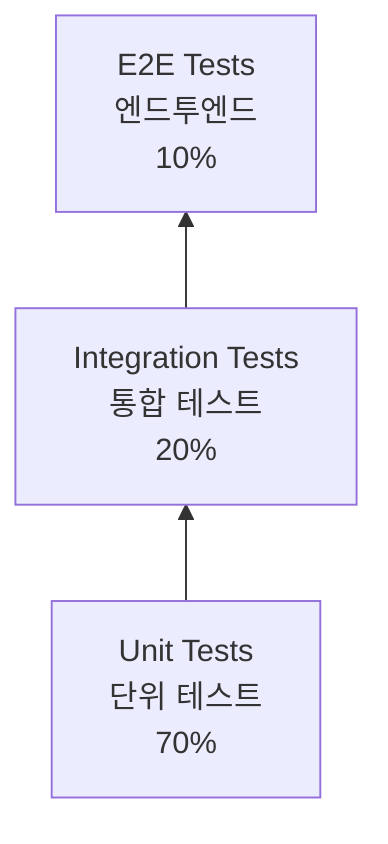
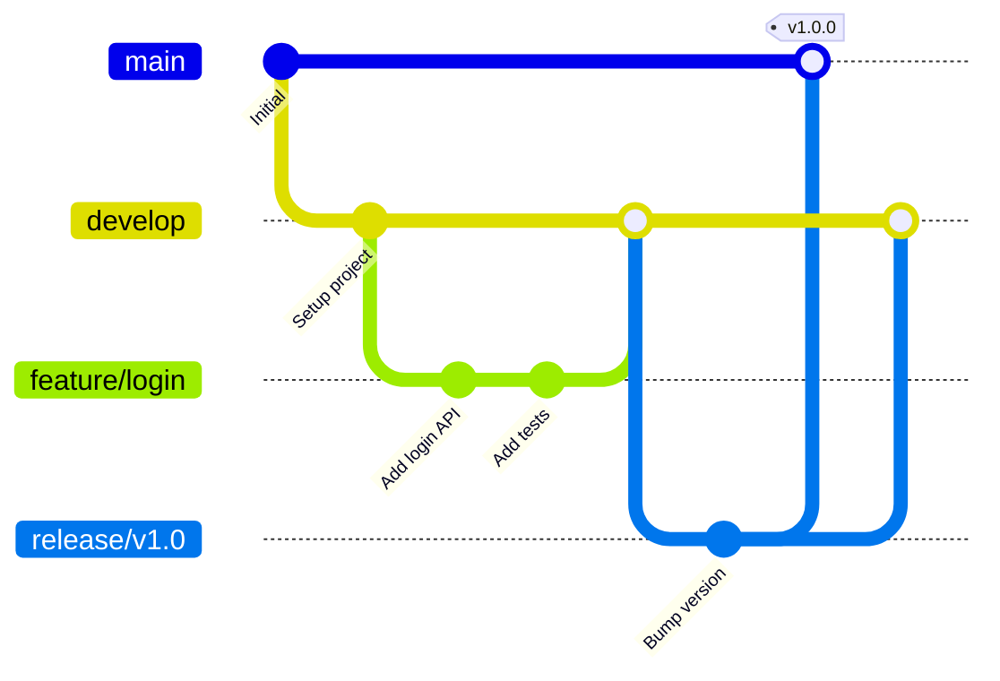

# 📘 Study 3: 테스트, 유지보수, 프로젝트 관리

**학습 목표**: 안정적인 백엔드 서비스 운영하기

---

## 📖 목차

1. [테스트 & 품질 관리](#1-테스트--품질-관리)
2. [소프트웨어 유지보수](#2-소프트웨어-유지보수)
3. [프로젝트 관리](#3-프로젝트-관리)
4. [실전 예제](#4-실전-예제)

---

## 1. 테스트 & 품질 관리

### 테스트 피라미드



### 1.1 Unit Test (단위 테스트)

**목적**: 함수 하나를 독립적으로 테스트

```python
"""
pytest로 단위 테스트 작성

설치: poetry add pytest pytest-cov
실행: pytest
커버리지: pytest --cov=.

🔗 공식 문서: https://docs.pytest.org/
"""

# ========== services/user_service.py ==========
class UserService:
    def calculate_age(self, birth_year: int) -> int:
        """나이 계산"""
        current_year = 2024
        return current_year - birth_year

# ========== tests/test_user_service.py ==========
import pytest
from services.user_service import UserService

def test_calculate_age():
    """나이 계산 테스트"""
    service = UserService()
    
    # Given (준비)
    birth_year = 1990
    
    # When (실행)
    age = service.calculate_age(birth_year)
    
    # Then (검증)
    assert age == 34

def test_calculate_age_with_invalid_year():
    """유효하지 않은 연도 테스트"""
    service = UserService()
    
    with pytest.raises(ValueError):
        service.calculate_age(3000)  # 미래 연도

# ========== Fixture 사용 ==========
@pytest.fixture
def user_service():
    """
    Fixture: 테스트 간 공통 설정
    매 테스트마다 새로운 UserService 생성
    """
    return UserService()

def test_with_fixture(user_service):
    """Fixture 활용"""
    age = user_service.calculate_age(1990)
    assert age == 34
```

### 1.2 Integration Test (통합 테스트)

**목적**: 여러 컴포넌트가 함께 작동하는지 테스트

```python
"""
DB와 함께 작동하는 통합 테스트

🔗 참고: https://fastapi.tiangolo.com/tutorial/testing/
"""

from fastapi.testclient import TestClient
from sqlalchemy import create_engine
from sqlalchemy.orm import sessionmaker
from main import app, get_db
from models.database import Base

# ========== 테스트용 DB 설정 ==========
SQLALCHEMY_TEST_DATABASE_URL = "sqlite:///./test.db"

engine = create_engine(SQLALCHEMY_TEST_DATABASE_URL)
TestingSessionLocal = sessionmaker(bind=engine)

def override_get_db():
    """테스트용 DB 세션"""
    db = TestingSessionLocal()
    try:
        yield db
    finally:
        db.close()

# DB 오버라이드
app.dependency_overrides[get_db] = override_get_db

# ========== 테스트 ==========
@pytest.fixture(scope="function")
def test_db():
    """각 테스트마다 깨끗한 DB"""
    Base.metadata.create_all(bind=engine)
    yield
    Base.metadata.drop_all(bind=engine)

client = TestClient(app)

def test_create_user(test_db):
    """유저 생성 API 테스트"""
    # Given
    user_data = {
        "name": "홍길동",
        "email": "hong@example.com"
    }
    
    # When
    response = client.post("/api/users", json=user_data)
    
    # Then
    assert response.status_code == 201
    data = response.json()
    assert data["name"] == "홍길동"
    assert "id" in data

def test_get_user(test_db):
    """유저 조회 API 테스트"""
    # 먼저 유저 생성
    client.post("/api/users", json={"name": "김철수", "email": "kim@example.com"})
    
    # 조회
    response = client.get("/api/users/1")
    assert response.status_code == 200
    assert response.json()["name"] == "김철수"
```

### 1.3 E2E Test (엔드투엔드)

**목적**: 실제 사용자 시나리오 테스트

```python
"""
Playwright로 E2E 테스트

설치: poetry add playwright
초기화: playwright install

🔗 공식 문서: https://playwright.dev/
"""

from playwright.sync_api import sync_playwright

def test_user_registration_flow():
    """회원가입 플로우 테스트"""
    with sync_playwright() as p:
        # 브라우저 실행
        browser = p.chromium.launch(headless=True)
        page = browser.new_page()
        
        # 1. 회원가입 페이지 접속
        page.goto("http://localhost:3000/register")
        
        # 2. 폼 입력
        page.fill('input[name="email"]', "test@example.com")
        page.fill('input[name="password"]', "password123")
        
        # 3. 제출
        page.click('button[type="submit"]')
        
        # 4. 성공 메시지 확인
        page.wait_for_selector('.success-message')
        assert "환영합니다" in page.content()
        
        browser.close()
```

### 1.4 Mock & Stub

**목적**: 외부 의존성 제거

```python
"""
Mock으로 외부 API 호출 테스트

🔗 참고: https://docs.python.org/3/library/unittest.mock.html
"""

from unittest.mock import Mock, patch
import requests

# ========== 실제 서비스 ==========
class PaymentService:
    def charge(self, user_id: int, amount: int) -> bool:
        """
        외부 결제 API 호출
        실제로는 돈을 청구하는 위험한 작업!
        """
        response = requests.post(
            "https://payment-api.com/charge",
            json={"user_id": user_id, "amount": amount}
        )
        return response.status_code == 200

# ========== 테스트 (Mock 사용) ==========
def test_charge_success():
    """결제 성공 테스트 (실제 API 호출 안 함!)"""
    service = PaymentService()
    
    # requests.post를 Mock으로 교체
    with patch('requests.post') as mock_post:
        # Mock 응답 설정
        mock_response = Mock()
        mock_response.status_code = 200
        mock_post.return_value = mock_response
        
        # 테스트
        result = service.charge(user_id=1, amount=10000)
        
        # 검증
        assert result is True
        mock_post.assert_called_once_with(
            "https://payment-api.com/charge",
            json={"user_id": 1, "amount": 10000}
        )
```

---

## 2. 소프트웨어 유지보수

### 2.1 로깅 (Logging)

**원칙**: 디버깅에 필요한 정보를 기록

```python
"""
Python logging 모듈

🔗 공식 문서: https://docs.python.org/3/library/logging.html
"""

import logging
from datetime import datetime

# ========== 로거 설정 ==========
logging.basicConfig(
    level=logging.INFO,
    format='%(asctime)s - %(name)s - %(levelname)s - %(message)s',
    handlers=[
        logging.FileHandler('app.log'),  # 파일에 저장
        logging.StreamHandler()          # 콘솔에도 출력
    ]
)

logger = logging.getLogger(__name__)

# ========== 로그 레벨 ==========
logger.debug("디버그 정보 (개발용)")      # DEBUG
logger.info("일반 정보")                  # INFO
logger.warning("경고 (주의 필요)")        # WARNING
logger.error("에러 발생!")                # ERROR
logger.critical("심각한 에러!")           # CRITICAL

# ========== 실전 예제 ==========
@router.post("/users")
def create_user(user: UserCreate, db: Session = Depends(get_db)):
    logger.info(f"회원가입 시도: {user.email}")
    
    try:
        # 유저 생성 로직
        db_user = User(**user.dict())
        db.add(db_user)
        db.commit()
        
        logger.info(f"회원가입 성공: user_id={db_user.id}")
        return db_user
        
    except Exception as e:
        logger.error(f"회원가입 실패: {user.email}, 에러={str(e)}")
        db.rollback()
        raise HTTPException(status_code=500, detail="Internal Server Error")

# ========== 구조화된 로깅 (JSON) ==========
import json

class JSONFormatter(logging.Formatter):
    """JSON 형식으로 로그 출력"""
    
    def format(self, record):
        log_data = {
            "timestamp": datetime.utcnow().isoformat(),
            "level": record.levelname,
            "message": record.getMessage(),
            "module": record.module,
            "function": record.funcName
        }
        return json.dumps(log_data)

# 사용
handler = logging.StreamHandler()
handler.setFormatter(JSONFormatter())
logger.addHandler(handler)
```

### 2.2 모니터링

**도구**: Sentry, DataDog, Prometheus

```python
"""
Sentry로 에러 모니터링

설치: poetry add sentry-sdk
🔗 공식 문서: https://docs.sentry.io/platforms/python/
"""

import sentry_sdk
from sentry_sdk.integrations.fastapi import FastApiIntegration

# ========== Sentry 초기화 ==========
sentry_sdk.init(
    dsn="https://your-dsn@sentry.io/project-id",
    integrations=[FastApiIntegration()],
    traces_sample_rate=1.0,  # 모든 트랜잭션 추적
    environment="production"
)

# ========== 에러 자동 캡처 ==========
@app.get("/error")
def trigger_error():
    """에러 발생 시 자동으로 Sentry에 전송"""
    raise ValueError("테스트 에러")

# ========== 수동 캡처 ==========
def process_payment(amount: int):
    try:
        # 결제 로직
        pass
    except Exception as e:
        # 추가 정보와 함께 Sentry에 전송
        sentry_sdk.capture_exception(
            e,
            extra={
                "amount": amount,
                "user_id": user_id
            }
        )
```

### 2.3 성능 최적화

**도구**: cProfile, line_profiler

```python
"""
성능 프로파일링

설치: poetry add line-profiler
🔗 참고: https://github.com/pyutils/line_profiler
"""

from line_profiler import LineProfiler

def slow_function():
    """느린 함수"""
    # N+1 쿼리 문제
    users = db.query(User).all()
    for user in users:
        posts = db.query(Post).filter(Post.user_id == user.id).all()  # ❌
    
def fast_function():
    """최적화된 함수"""
    # JOIN으로 한 번에 조회
    users = db.query(User).options(joinedload(User.posts)).all()  # ✅

# ========== 프로파일링 ==========
profiler = LineProfiler()
profiler.add_function(slow_function)
profiler.add_function(fast_function)

profiler.run('slow_function()')
profiler.print_stats()

# 결과:
# Line #  Hits  Time     Per Hit  % Time  Line Contents
# ======  ====  =======  =======  ======  =============
#     10     1  500.0    500.0    100.0     for user in users:
#     11   100  5000.0    50.0    90.0        posts = db.query...
```

---

## 3. 프로젝트 관리

### 3.1 이슈 트래킹

**GitHub Issues 활용**:

```markdown
## 버그 리포트 템플릿

**환경**
- OS: Ubuntu 22.04
- Python: 3.12
- FastAPI: 0.104.1

**재현 단계**
1. POST /api/users로 유저 생성
2. GET /api/users/1 호출
3. 500 에러 발생

**예상 결과**
200 OK with user data

**실제 결과**
```json
{
  "detail": "Internal Server Error"
}
```

**로그**
```
ERROR - AttributeError: 'NoneType' object has no attribute 'email'
```
```

### 3.2 Git 브랜치 전략



**브랜치 종류**:
- `main`: 프로덕션
- `develop`: 개발
- `feature/*`: 기능 개발
- `bugfix/*`: 버그 수정
- `release/*`: 릴리스 준비

### 3.3 CI/CD 파이프라인

**GitHub Actions 예제**:

```yaml
# .github/workflows/test.yml
name: Test & Deploy

on:
  push:
    branches: [ main, develop ]
  pull_request:
    branches: [ main ]

jobs:
  test:
    runs-on: ubuntu-latest
    
    steps:
    - uses: actions/checkout@v3
    
    - name: Set up Python
      uses: actions/setup-python@v4
      with:
        python-version: '3.12'
    
    - name: Install dependencies
      run: |
        pip install poetry
        poetry install
    
    - name: Run tests
      run: poetry run pytest --cov=.
    
    - name: Lint
      run: poetry run ruff check .
  
  deploy:
    needs: test
    if: github.ref == 'refs/heads/main'
    runs-on: ubuntu-latest
    
    steps:
    - name: Deploy to production
      run: |
        # Docker 배포 스크립트
        docker build -t myapp .
        docker push myapp:latest
```

---

## 4. 실전 예제

### 완전한 프로젝트 구조

```
project/
├── .github/
│   └── workflows/
│       ├── test.yml          # CI/CD
│       └── deploy.yml
├── app/
│   ├── __init__.py
│   ├── main.py
│   ├── config.py             # 설정
│   ├── dependencies.py       # 의존성
│   ├── controller/
│   ├── services/
│   ├── repositories/
│   └── models/
├── tests/
│   ├── unit/
│   ├── integration/
│   └── e2e/
├── scripts/
│   ├── setup.sh              # 환경 설정
│   └── deploy.sh             # 배포
├── docs/
│   ├── api.md                # API 문서
│   └── architecture.md       # 아키텍처 설명
├── .gitignore
├── pyproject.toml
├── pytest.ini
├── Dockerfile
└── docker-compose.yml
```

### 설정 파일 관리

```python
"""
config.py - 환경별 설정 관리

🔗 참고: https://pydantic-docs.helpmanual.io/usage/settings/
"""

from pydantic_settings import BaseSettings

class Settings(BaseSettings):
    """
    환경 변수로 설정 관리
    
    .env 파일 예시:
    DATABASE_URL=mysql://...
    SECRET_KEY=your-secret-key
    DEBUG=True
    """
    
    # DB
    DATABASE_URL: str
    
    # 보안
    SECRET_KEY: str
    ALGORITHM: str = "HS256"
    ACCESS_TOKEN_EXPIRE_MINUTES: int = 30
    
    # 기타
    DEBUG: bool = False
    LOG_LEVEL: str = "INFO"
    
    class Config:
        env_file = ".env"

# 싱글톤
settings = Settings()

# 사용
from app.config import settings

engine = create_engine(settings.DATABASE_URL)
```

---

## 📚 추가 학습 자료

### 테스트
- [Pytest 공식 문서](https://docs.pytest.org/)
- [Test-Driven Development](https://www.obeythetestinggoat.com/)

### 유지보수
- [The Twelve-Factor App](https://12factor.net/)
- [Logging Best Practices](https://betterstack.com/community/guides/logging/python/)

### 프로젝트 관리
- [Scrum Guide](https://scrumguides.org/)
- [Atlassian Git Tutorial](https://www.atlassian.com/git/tutorials)

---

**다음 학습**: [study4.md - 오픈소스 협업 & 한국 개발 문화](./study4.md)

## 🎯 오늘의 실습 과제 (Daily Challenges)

### Day 1: 첫 테스트 작성
```python
"""
과제: UserService 테스트 작성

파일: tests/test_user_service.py
"""

import pytest
from services.user_service import UserService

def test_create_user():
    """유저 생성 테스트"""
    # TODO: 테스트 작성
    pass

def test_duplicate_email():
    """중복 이메일 테스트"""
    # TODO: ValueError 발생하는지 확인
    pass

# ✍️ pytest 실행: poetry run pytest
```

### Day 2: 테스트 커버리지 100%
```bash
# 과제: 현재 프로젝트 커버리지 확인

# 1. 커버리지 측정
poetry run pytest --cov=. --cov-report=html

# 2. htmlcov/index.html 열어서 확인

# 3. 커버리지 낮은 파일 찾아서 테스트 추가
```

### Day 3: CI/CD 파이프라인 구축
```yaml
# 과제: GitHub Actions 설정

# 파일: .github/workflows/test.yml

name: Test

on:push]

jobs:
  test:
    runs-on: ubuntu-latest
    
    steps:
    - uses: actions/checkout@v3
    
    - name: Set up Python
      uses: actions/setup-python@v4
      with:
        python-version: '3.12'
    
    - name: Install dependencies
      run: |
        pip install poetry
        poetry install
    
    - name: Run tests
      run: poetry run pytest --cov=.
    
    - name: Upload coverage
      uses: codecov/codecov-action@v3

# ✍️ GitHub에 push하고 Actions 탭 확인!
```

---

## 📦 테스트 & 품질 관리 라이브러리

### 1. pytest-asyncio - 비동기 테스트
```python
"""
FastAPI의 async 함수 테스트

설치: poetry add pytest-asyncio
🔗 공식 문서: https://pytest-asyncio.readthedocs.io/
"""

import pytest

@pytest.mark.asyncio
async def test_async_endpoint():
    """비동기 엔드포인트 테스트"""
    async with AsyncClient(app=app, base_url="http://test") as client:
        response = await client.get("/api/users")
        assert response.status_code == 200
```

### 2. Faker - 테스트 데이터 생성
```python
"""
가짜 데이터를 쉽게 생성

설치: poetry add faker
🔗 공식 문서: https://faker.readthedocs.io/
"""

from faker import Faker

fake = Faker('ko_KR')  # 한국어

# 랜덤 데이터 생성
name = fake.name()  # "김철수"
email = fake.email()  # "kim@example.com"
address = fake.address()  # "서울특별시..."

# 테스트에 활용
def test_create_users():
    """100명의 유저 생성 테스트"""
    for _ in range(100):
        user = User(
            name=fake.name(),
            email=fake.email()
        )
        db.add(user)
    db.commit()
```

### 3. Locust - 부하 테스트
```python
"""
대용량 트래픽 테스트

설치: poetry add locust
🔗 공식 문서: https://locust.io/
"""

from locust import HttpUser, task, between

class WebsiteUser(HttpUser):
    """가상 사용자"""
    wait_time = between(1, 3)  # 1-3초 대기
    
    @task(3)  # 가중치 3
    def view_posts(self):
        """게시글 조회"""
        self.client.get("/api/posts")
    
    @task(1)  # 가중치 1
    def create_post(self):
        """게시글 작성"""
        self.client.post("/api/posts", json={
            "title": "Test",
            "content": "Test content"
        })

# 실행: locust -f locustfile.py
# 브라우저에서 http://localhost:8089 접속
```

### 4. Black - 코드 포맷터
```python
"""
Python 코드를 자동으로 예쁘게

설치: poetry add black --group dev
🔗 공식 문서: https://black.readthedocs.io/
"""

# pyproject.toml에 설정
"""
[tool.black]
line-length = 100
target-version = ['py312']
"""

# 실행
# poetry run black .
```

### 5. Ruff - 초고속 린터
```python
"""
Flake8, isort 등을 대체하는 빠른 린터

설치: poetry add ruff --group dev
🔗 공식 문서: https://docs.astral.sh/ruff/
"""

# pyproject.toml
"""
[tool.ruff]
line-length = 100
select = ["E", "F", "I"]
"""

# 실행
# poetry run ruff check .
# poetry run ruff check . --fix  # 자동 수정
```

---

## 💪 레벨업 도전 과제

### 🌟 초급 (Day 1-3)
- [ ] 첫 Unit Test 작성
- [ ] 커버리지 50% 달성
- [ ] pytest 마스터

### 🌟🌟 중급 (Day 4-7)
- [ ] 커버리지 80% 달성
- [ ] Integration Test 추가
- [ ] GitHub Actions CI/CD 구축

### 🌟🌟🌟 고급 (Week 2)
- [ ] E2E 테스트 (Playwright)
- [ ] 부하 테스트 (Locust)
- [ ] Sentry 연동

---

**다음 학습**: [study4.md - 협업 & 오픈소스](./study4.md) 🚀
