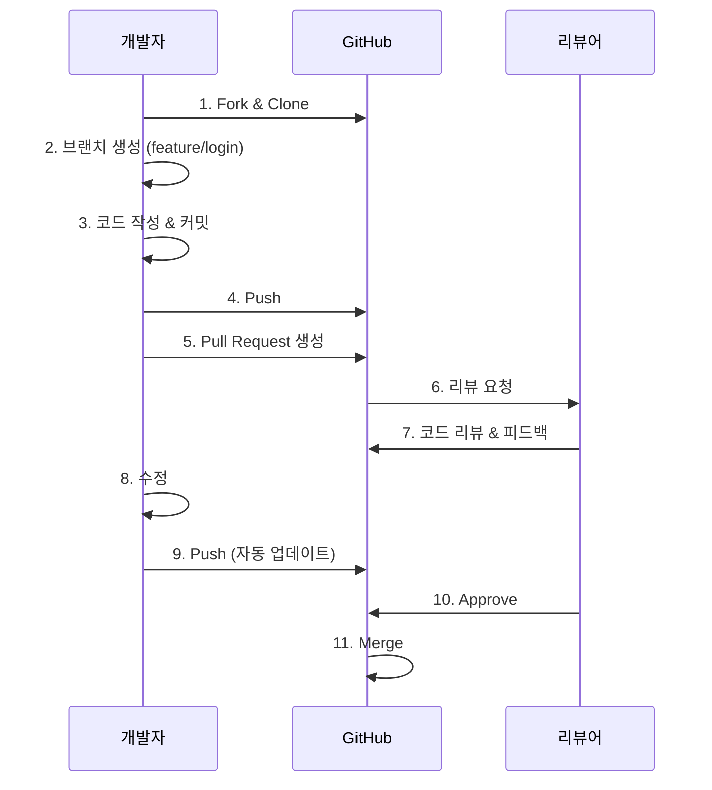
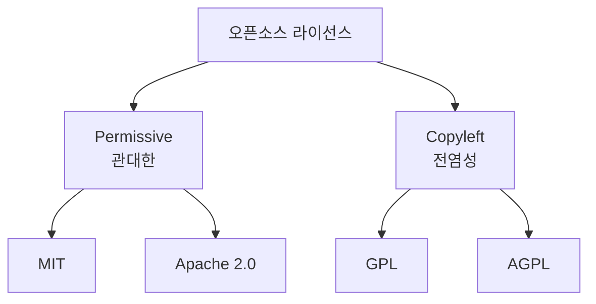
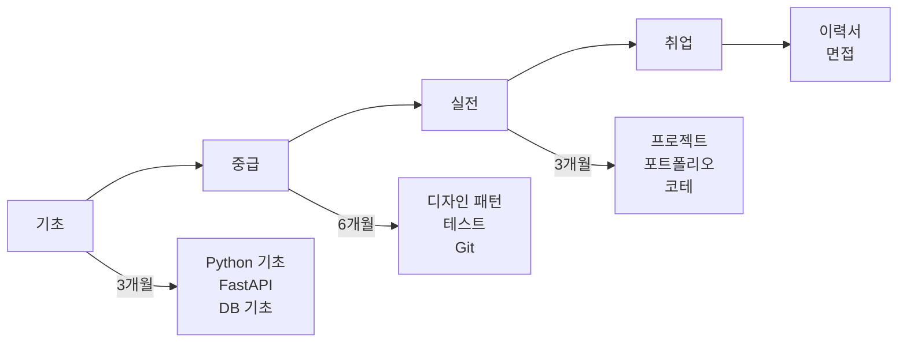

# 📘 Study 4: 협업 & 오픈소스 & 한국 개발 문화

**학습 목표**: 실전 협업과 오픈소스 기여

---

## 📖 목차

1. [온라인 협업](#1-온라인-협업)
2. [오픈소스 라이선스](#2-오픈소스-라이선스)
3. [한국 개발자 문화](#3-한국-개발자-문화)
4. [실전 예제](#4-실전-예제)

---

## 1. 온라인 협업

### 1.1 Git 협업 워크플로우

#### Pull Request (PR) 과정



#### 실전 Git 명령어

```bash
# ========== 1. 저장소 포크 & 복제 ==========
git clone https://github.com/username/repo.git
cd repo

# 원본 저장소 연결 (upstream)
git remote add upstream https://github.com/original/repo.git

# ========== 2. 브랜치 생성 ==========
git checkout -b feature/add-login

# ========== 3. 작업 & 커밋 ==========
git add .
git commit -m "feat: Add login API endpoint"

# ========== 4. 원본 저장소 최신화 ==========
git fetch upstream
git rebase upstream/main

# ========== 5. Push ==========
git push origin feature/add-login

# ========== 6. Conflict 해결 ==========
# 충돌 발생 시
git status  # 충돌 파일 확인
# 파일 수정
git add .
git rebase --continue

# ========== 7. 커밋 수정 ==========
git commit --amend  # 마지막 커밋 수정
git rebase -i HEAD~3  # 최근 3개 커밋 수정
```

### 1.2 코드 리뷰

**좋은 PR**:
```markdown
## 변경 사항
- 로그인 API 엔드포인트 추가 (`POST /api/login`)
- JWT 토큰 발급 기능 구현

## 이유
closes #123

## 테스트
- [x] 단위 테스트 추가
- [x] 통합 테스트 추가
- [x] 수동 테스트 완료

## 스크린샷

```

**좋은 리뷰 코멘트**:
```
✅ "이 부분은 try-except로 감싸는 게 좋을 것 같아요!"
✅ "성능을 위해 이 쿼리에 인덱스를 추가하면 어떨까요?"

❌ "이거 잘못됐네요" (구체적이지 않음)
❌ "다시 하세요" (건설적이지 않음)
```

---

## 2. 오픈소스 라이선스

### 주요 라이선스 비교



### 라이선스별 특징

#### MIT License (가장 자유로움)
```
✅ 상업적 이용 가능
✅ 수정 가능
✅ 배포 가능
✅ Private 사용 가능
⚠️ 라이선스 명시 필요

사용 예: React, Vue.js, Express
```

#### Apache 2.0
```
✅ MIT와 비슷
✅ 특허 보호 추가
⚠️ 수정 사항 명시 필요

사용 예: Kubernetes, TensorFlow
```

#### GPL (GNU General Public License)
```
✅ 자유롭게 복사, 수정, 배포
⚠️ 수정한 코드도 GPL로 공개 필수 (전염성!)

사용 예: Linux, Git
```

#### AGPL (가장 강력한 Copyleft)
```
⚠️ 네트워크로 제공해도 소스 공개 필수
⚠️ SaaS도 소스 공개해야 함

사용 예: MongoDB (과거)
```

### Python 패키지 라이선스 확인

```python
"""
pip-licenses로 라이선스 확인

설치: pip install pip-licenses
"""

# 사용
!pip-licenses

# 결과 예시:
# Name          Version  License
# FastAPI       0.104.1  MIT
# SQLAlchemy    2.0.23   MIT
# Django        4.2.0    BSD-3-Clause
```

### 라이선스 선택 가이드

```python
"""
프로젝트에 라이선스 추가하기
"""

# ========== LICENSE 파일 생성 ==========
# 1. GitHub에서 저장소 생성 시 라이선스 선택
# 2. 또는 직접 추가

# MIT License 예시 (LICENSE 파일)
"""
MIT License

Copyright (c) 2024 Your Name

Permission is hereby granted, free of charge...
"""

# ========== pyproject.toml에 명시 ==========
"""
[tool.poetry]
name = "my-project"
license = "MIT"
"""
```

---

## 3. 한국 개발자 문화

### 3.1 한국 IT 업계 특징

**대기업 vs 스타트업**:

```
대기업 (삼성, LG, 네이버, 카카오):
  ✅ 안정적
  ✅ 복지 좋음
  ⚠️ 보수적
  ⚠️ 레거시 코드
  
스타트업:
  ✅ 최신 기술
  ✅ 빠른 성장
  ⚠️ 불안정
  ⚠️ 과도한 업무량
```

### 3.2 취업 준비

**백엔드 개발자 로드맵**:



**포트폴리오 프로젝트 아이디어**:
1. 블로그 시스템 (Django/FastAPI)
2. 채팅 앱 (WebSocket)
3. 결제 시스템 (초기 스타트업 경험)
4. 오픈소스 기여

### 3.3 면접 준비

**기술 면접 주요 질문**:

```python
# ========== 1. 파이썬 기초 ==========
Q: GIL이 뭔가요?
A: Global Interpreter Lock. 
   한 번에 하나의 스레드만 실행되게 하는 잠금 장치.
   멀티스레딩의 효과가 제한적.

Q: 데코레이터란?
A: 함수를 감싸서 기능을 추가하는 패턴
   예: @login_required, @cache

# ========== 2. 백엔드 개념 ==========
Q: REST vs GraphQL?
A: REST는 리소스 중심, 여러 엔드포인트
   GraphQL은 단일 엔드포인트, 원하는 데이터만 요청

Q: DB 인덱스란?
A: 검색 속도를 높이는 자료구조
   B-Tree, Hash 등

# ========== 3. 시스템 설계 ==========
Q: 대용량 트래픽 처리는?
A: 
  1. 캐싱 (Redis)
  2. 로드 밸런싱
  3. DB 복제 (Read Replica)
  4. CDN

# ========== 4. 실무 경험 ==========
Q: 가장 어려웠던 버그는?
A: 구체적인 사례 + 해결 과정 설명
```

---

## 4. 실전 예제

### 4.1 오픈소스 기여하기

```bash
# ========== 1. 기여할 프로젝트 찾기 ==========
# Good First Issue 태그 검색
https://github.com/search?q=label%3A%22good+first+issue%22+language%3APython

# ========== 2. 이슈 확인 ==========
# 이슈를 읽고 "I'll work on this" 코멘트

# ========== 3. Fork & Clone ==========
git clone https://github.com/your-username/project.git

# ========== 4. 개발 환경 설정 ==========
# CONTRIBUTING.md 파일 확인

# ========== 5. 브랜치 생성 ==========
git checkout -b fix/issue-123

# ========== 6. 코드 수정 ==========
# 테스트 작성 필수!

# ========== 7. PR 생성 ==========
# 제목: "Fix: Resolve issue #123"
# 본문: 변경 사항 자세히 설명
```

### 4.2 팀 협업 프로젝트

**프로젝트 구조**:

```
team-project/
├── .github/
│   ├── ISSUE_TEMPLATE/
│   │   ├── bug_report.md
│   │   └── feature_request.md
│   └── PULL_REQUEST_TEMPLATE.md
├── docs/
│   ├── CONTRIBUTING.md        # 기여 가이드
│   ├── CODE_OF_CONDUCT.md     # 행동 강령
│   └── STYLE_GUIDE.md         # 코딩 스타일
├── src/
└── tests/
```

**CONTRIBUTING.md 예시**:

```markdown
# 기여 가이드

## 개발 환경 설정
```bash
git clone https://github.com/team/project.git
poetry install
poetry run pre-commit install
```

## 브랜치 전략
- `main`: 프로덕션
- `develop`: 개발
- `feature/*`: 새 기능
- `bugfix/*`: 버그 수정

## 커밋 메시지
- `feat`: 새 기능
- `fix`: 버그 수정
- `docs`: 문서
- `test`: 테스트

## 코드 스타일
- PEP 8 준수
- Black으로 포맷팅
- Ruff로 린팅
```

---

## 📚 추가 학습 자료

### 협업
- [Git Flow](https://nvie.com/posts/a-successful-git-branching-model/)
- [Conventional Commits](https://www.conventionalcommits.org/)

### 오픈소스
- [Choose a License](https://choosealicense.com/)
- [Open Source Guide](https://opensource.guide/)

### 취업
- [프로그래머스](https://programmers.co.kr/) - 코딩 테스트
- [wanted](https://www.wanted.co.kr/) - 채용 정보

---

**완료!** 모든 study 파일을 마쳤습니다. [index.md로 돌아가기](./README_STUDY.md)
