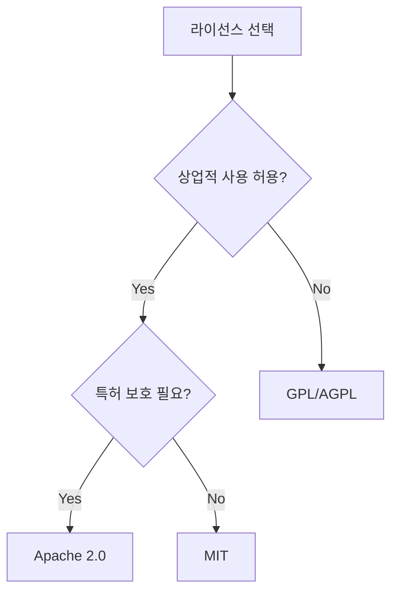

# 📘 09_라이선스_이해

**학습 목표**: 법적 문제 없이 오픈소스 사용 & 배포

---

## 📜 왜 라이선스가 중요한가?

**실제 사례**:
- MongoDB가 AGPL로 변경 → AWS가 DocumentDB 출시
- MySQL이 GPL → MariaDB 탄생
- React 특허 조항 → Vue.js 인기

**결론**: 라이선스 모르면 큰일남!

🔗 [오픈소스 라이선스란?](https://opensource.org/licenses)

---

## 🌐 라이선스 종류 (사용 빈도순)

### 1위: MIT License (가장 자유로움)
**점유율**: ~30%

**특징**:
- ✅ 상업적 사용 가능
- ✅ 수정 가능
- ✅ 배포 가능
- ✅ Private 사용 가능
- ⚠️ 라이선스 명시만 필요
- ✅ 소스 공개 불필요

**사용 예시**:
- React, Vue.js, Angular
- Express.js, Flask
- jQuery, Bootstrap

**언제 선택?**:
- 많은 사람이 쓰길 원할 때
- 상업적 이용 허용
- 기여 많이 받고 싶을 때

```
MIT License

Copyright (c) 2024 Your Name

Permission is hereby granted, free of charge...
```

🔗 [MIT License 전문](https://opensource.org/license/mit)

---

### 2위: Apache 2.0
**점유율**: ~20%

**특징**:
- ✅ MIT와 거의 동일
- ✅ **특허 보호** 추가
- ⚠️ 수정 사항 명시 필요
- ⚠️ NOTICE 파일 유지

**사용 예시**:
- Kubernetes, TensorFlow
- Android, Hadoop

**MIT vs Apache 2.0**:
```
MIT: 간단, 짧음
Apache: 더 명확한 특허 보호
```

🔗 [Apache 2.0 License](https://www.apache.org/licenses/LICENSE-2.0)

---

### 3위: GPL (GNU General Public License)
**점유율**: ~15%

**특징**:
- ⚠️⚠️ **전염성(Copyleft)** - 가장 중요!
- ⚠️ 수정한 코드도 **GPL로 공개 필수**
- ⚠️ 상업적 이용 시 소스 공개
- ✅ 자유롭게 사용, 수정, 배포

**사용 예시**:
- Linux Kernel
- Git, GCC
- WordPress

**주의사항**:
```python
# GPL 라이브러리를 사용하면
# 내 전체 프로젝트도 GPL로 공개해야 함!

import gpl_library  # ← 이거 쓰면
# 내 코드 전체를 GPL로 공개해야 함
```

**언제 선택?**:
- 오픈소스 생태계 기여
- 상업적 독점 방지
- 자유 소프트웨어 철학

🔗 [GPL v3](https://www.gnu.org/licenses/gpl-3.0.html)

---

### 4위: AGPL (가장 강력한 Copyleft)
**점유율**: ~5%

**특징**:
- ⚠️⚠️⚠️ GPL보다 더 강력!
- ⚠️ **네트워크로 서비스해도** 소스 공개
- ⚠️ SaaS도 소스 공개 필요

**차이점**:
```
GPL: 배포하면 소스 공개
AGPL: 네트워크로 제공해도 소스 공개
```

**예시**:
```
MongoDB (과거) → AGPL
→ AWS가 못 쓰게 함
→ MongoDB가 SSPL (더 강력)로 변경
→ AWS가 DocumentDB 만듦
```

🔗 [AGPL v3](https://www.gnu.org/licenses/agpl-3.0.html)

---

### 5위: BSD License
**특징**:
- MIT과 거의 유사
- 약간 더 짧음

---

## 🎯 라이선스 선택 가이드



---

## 💻 프로젝트에 라이선스 추가

### 1. LICENSE 파일 생성

```bash
# GitHub에서 자동 생성
# 저장소 생성 시 "Add a license" 선택

# 또는 수동으로
touch LICENSE
```

**MIT License 예시**:
```
MIT License

Copyright (c) 2024 홍길동

Permission is hereby granted, free of charge, to any person obtaining a copy
of this software and associated documentation files (the "Software"), to deal
in the Software without restriction, including without limitation the rights
to use, copy, modify, merge, publish, distribute, sublicense, and/or sell
copies of the Software, and to permit persons to whom the Software is
furnished to do so, subject to the following conditions:

The above copyright notice and this permission notice shall be included in all
copies or substantial portions of the Software.

THE SOFTWARE IS PROVIDED "AS IS", WITHOUT WARRANTY OF ANY KIND...
```

### 2. pyproject.toml에 명시

```toml
[tool.poetry]
name = "my-project"
version = "0.1.0"
license = "MIT"
```

### 3. README에 배지 추가

```markdown
# My Project

[](https://opensource.org/licenses/MIT)
```

---

## 🔍 사용 중인 패키지 라이선스 확인

### pip-licenses 사용

```bash
# 설치
pip install pip-licenses

# 확인
pip-licenses

# 결과 예시:
# Name          Version  License
# FastAPI       0.104.1  MIT
# SQLAlchemy    2.0.23   MIT
# Django        4.2.0    BSD-3-Clause
# PyMySQL       1.1.0    MIT
```

### Poetry로 확인

```bash
# 의존성 트리
poetry show --tree

# 특정 패키지
poetry show fastapi
```

---

## ⚠️ 실전 주의사항

### 1. GPL 라이브러리 사용 시
```python
# ❌ 상업적 SaaS에서 GPL 사용
import gpl_library

# ✅ 대안 찾기
import mit_alternative
```

### 2. 라이선스 충돌
```
프로젝트: MIT
의존성: GPL → ⚠️ 충돌!

해결: GPL 라이브러리 제거 or 프로젝트를 GPL로 변경
```

### 3. 라이선스 명시
```python
# 파일 상단에 명시
"""
Copyright (c) 2024 홍길동
Licensed under the MIT License
"""
```

---

## 📚 라이선스 비교표

| 라이선스 | 상업적 사용 | 수정 | 배포 | 소스 공개 | 특허 보호 |
|---------|-----------|------|------|----------|----------|
| MIT | ✅ | ✅ | ✅ | ❌ | ❌ |
| Apache 2.0 | ✅ | ✅ | ✅ | ❌ | ✅ |
| GPL | ✅ | ✅ | ✅ | ⚠️ 필수 | ❌ |
| AGPL | ✅ | ✅ | ✅ | ⚠️⚠️ 필수 | ❌ |

---

## 🎯 실습 과제

### Day 1: 라이선스 추가
```bash
# 1. 프로젝트에 LICENSE 파일 추가
# 2. pyproject.toml 수정
# 3. README에 배지 추가
# 4. Git commit
git add LICENSE pyproject.toml README.md
git commit -m "Add MIT license"
```

### Day 2: 의존성 라이선스 확인
```bash
# 모든 패키지 라이선스 확인
pip-licenses > licenses.txt

# GPL/AGPL 패키지 찾기
pip-licenses | grep -E "GPL|AGPL"
```

---

## 💪 레벨업 과제

### 🌟 초급
- [ ] 프로젝트에 라이선스 추가
- [ ] 의존성 라이선스 확인
- [ ] README에 배지 추가

### 🌟🌟 중급
- [ ] NOTICE 파일 생성 (Apache 2.0 사용 시)
- [ ] 라이선스 충돌 해결
- [ ] 상용 라이선스 이해

### 🌟🌟🌟 고급
- [ ] Dual License 전략
- [ ] CLA (Contributor License Agreement)
- [ ] 라이선스 자동 체크 (CI)

---

## 📖 추가 자료

- [Choose a License](https://choosealicense.com/) - 라이선스 선택 도우미
- [TLDRLegal](https://www.tldrlegal.com/) - 라이선스 쉬운 설명
- [SPDX License List](https://spdx.org/licenses/) - 전체 라이선스 목록

---

**다음 학습**: [10_FastAPI_완벽_마스터.md](./10_FastAPI_완벽_마스터.md) 🚀
