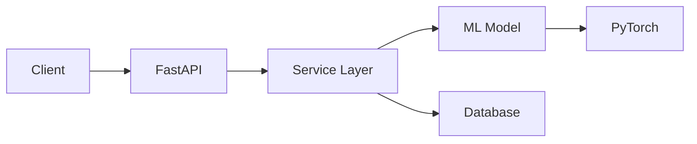

# 📘 10_FastAPI_완벽_마스터

**학습 목표**: 생성형 AI 없이 독립적으로 FastAPI 프로젝트 완성

---

## ✅ 마스터 체크리스트

스스로 평가해보세요. 모두 체크하면 마스터!

### Level 1: 기초 (1-2주)
- [ ] FastAPI 프로젝트를 빈 폴더에서 30분 안에 시작
- [ ] CRUD API 1시간 안에 완성
- [ ] Pydantic으로 데이터 검증
- [ ] SQLAlchemy로 DB 연동
- [ ] Swagger UI(`/docs`) 활용

### Level 2: 중급 (3-4주)
- [ ] 3계층 아키텍처 자연스럽게 적용
- [ ] Repository, Service 패턴 사용
- [ ] 의존성 주입 이해 & 활용
- [ ] 환경 변수로 설정 관리
- [ ] JWT 인증 구현

### Level 3: 고급 (5-6주)
- [ ] pytest로 테스트 커버리지 80%
- [ ] CI/CD 파이프라인 구축
- [ ] Docker 컨테이너화
- [ ] 에러 로깅 & 모니터링 (Sentry)
- [ ] 성능 최적화 (캐싱, 인덱스)

### Level 4: 마스터 (7-8주)
- [ ] 에러 발생 시 로그만 보고 즉시 해결
- [ ] 성능 병목 지점 파악 & 해결
- [ ] 코드 리뷰 제공 가능
- [ ] 아키텍처 설계 가능
- [ ] 배포부터 모니터링까지 전 과정 가능

---

## 🚀 최종 프로젝트: ML 모델 서빙 API

**목표**: PyTorch 준비 - ML 모델을 API로 서빙

### 프로젝트 개요
```
프로젝트명: AI Image Classifier API
기능:
  1. 이미지 업로드
  2. AI 모델로 분류
  3. 결과 저장 & 조회
  4. 사용자 관리 (JWT)

기술 스택:
  - FastAPI
  - PyTorch (사전 학습 모델)
  - Azure MySQL
  - Docker
  - GitHub Actions
```

### 아키텍처



### 디렉토리 구조
```
ml-api/
├── app/
│   ├── main.py
│   ├── config.py
│   ├── controller/
│   │   ├── auth.py
│   │   ├── images.py
│   │   └── predictions.py
│   ├── services/
│   │   ├── auth_service.py
│   │   ├── image_service.py
│   │   └── ml_service.py
│   ├── repositories/
│   │   ├── user_repository.py
│   │   └── prediction_repository.py
│   ├── models/
│   │   ├── database.py
│   │   ├── models.py
│   │   └── schemas.py
│   └── ml/
│       ├── classifier.py
│       └── pretrained_model.pth
├── tests/
├── docs/
├── Dockerfile
├── docker-compose.yml
├── .github/workflows/
└── pyproject.toml
```

---

## 💻 단계별 구현

### Week 1: 기본 구조

```python
# app/main.py
from fastapi import FastAPI
from app.controller import auth, images, predictions

app = FastAPI(title="ML API")

app.include_router(auth.router)
app.include_router(images.router)
app.include_router(predictions.router)

@app.get("/health")
def health_check():
    return {"status": "healthy"}
```

### Week 2: ML 모델 통합

```python
# app/ml/classifier.py
"""
PyTorch 모델 로딩

🔗 참고: https://pytorch.org/tutorials/
"""

import torch
from torchvision import models, transforms
from PIL import Image

class ImageClassifier:
    def __init__(self, model_path: str):
        """사전 학습된 ResNet 모델 로드"""
        self.model = models.resnet50(pretrained=True)
        self.model.eval()
        
        # 이미지 전처리
        self.transform = transforms.Compose([
            transforms.Resize(256),
            transforms.CenterCrop(224),
            transforms.ToTensor(),
            transforms.Normalize(
                mean=[0.485, 0.456, 0.406],
                std=[0.229, 0.224, 0.225]
            )
        ])
    
    def predict(self, image_path: str):
        """이미지 분류"""
        image = Image.open(image_path)
        image_tensor = self.transform(image).unsqueeze(0)
        
        with torch.no_grad():
            outputs = self.model(image_tensor)
            _, predicted = torch.max(outputs, 1)
        
        return {
            "class_id": predicted.item(),
            "confidence": torch.softmax(outputs, dim=1)[0][predicted].item()
        }

# app/services/ml_service.py
class MLService:
    def __init__(self):
        self.classifier = ImageClassifier("models/resnet50.pth")
    
    def classify_image(self, image_path: str):
        """이미지 분류 + DB 저장"""
        result = self.classifier.predict(image_path)
        # DB에 결과 저장
        return result
```

### Week 3: API 엔드포인트

```python
# app/controller/predictions.py
from fastapi import APIRouter, File, UploadFile, Depends
from app.services.ml_service import MLService

router = APIRouter(prefix="/api/predict", tags=["predictions"])

@router.post("/")
async def predict_image(
    file: UploadFile = File(...),
    service: MLService = Depends()
):
    """
    이미지 업로드 & 분류
    
    Returns:
        {
            "class": "dog",
            "confidence": 0.95,
            "created_at": "..."
        }
    """
    # 이미지 저장
    file_path = f"uploads/{file.filename}"
    with open(file_path, "wb") as f:
        f.write(await file.read())
    
    # 분류
    result = service.classify_image(file_path)
    return result

@router.get("/history")
def get_prediction_history(
    db: Session = Depends(get_db)
):
    """예측 히스토리 조회"""
    return db.query(Prediction).all()
```

### Week 4: 테스트 & 배포

```python
# tests/test_ml_service.py
import pytest
from app.ml.classifier import ImageClassifier

def test_classifier():
    """모델 테스트"""
    classifier = ImageClassifier("models/resnet50.pth")
    result = classifier.predict("tests/sample_dog.jpg")
    
    assert "class_id" in result
    assert 0 <= result["confidence"] <= 1

# .github/workflows/deploy.yml
name: Deploy

on:
  push:
    branches: [main]

jobs:
  deploy:
    runs-on: ubuntu-latest
    steps:
      - uses: actions/checkout@v3
      
      - name: Build Docker
        run: docker build -t ml-api .
      
      - name: Deploy to Azure
        run: |
          # Azure Container Registry push
          docker push ml-api:latest
```

---

## 📦 필수 라이브러리 (PyTorch 포함)

```bash
# ML
poetry add torch torchvision

# 이미지 처리
poetry add pillow

# FastAPI
poetry add fastapi uvicorn sqlalchemy pydantic

# 파일 업로드
poetry add python-multipart

# 환경 설정
poetry add python-dotenv pydantic-settings

# 보안
poetry add python-jose passlib bcrypt

# 테스트
poetry add pytest pytest-cov --group dev
```

---

## 🎯 실습 과제

### 프로젝트 완성 체크리스트

#### Phase 1: MVP (Week 1-2)
- [ ] FastAPI 프로젝트 생성
- [ ] DB 모델 설계 (User, Image, Prediction)
- [ ] PyTorch 모델 로딩 성공
- [ ] 이미지 업로드 API
- [ ] 예측 API 완성

#### Phase 2: 기능 확장 (Week 3)
- [ ] JWT 인증 추가
- [ ] 사용자별 히스토리
- [ ] 이미지 저장 (Azure Blob Storage)
- [ ] 에러 핸들링
- [ ] 로깅

#### Phase 3: 품질 향상 (Week 4)
- [ ] Unit Test 작성
- [ ] Integration Test
- [ ] API 문서화
- [ ] 성능 측정

#### Phase 4: 배포 (Week 5)
- [ ] Dockerfile 작성
- [ ] CI/CD 파이프라인
- [ ] Azure 배포
- [ ] 모니터링 (Sentry)

---

## 💪 추가 도전 과제

### 🌟🌟 고급 기능
- [ ] 배치 예측 (여러 이미지 동시 처리)
- [ ] 웹소켓으로 실시간 진행률
- [ ] 모델 버전 관리
- [ ] A/B 테스팅

### 🌟🌟🌟 마스터 기능
- [ ] GPU 지원
- [ ] 분산 처리 (Celery)
- [ ] 모델 재학습 API
- [ ] MLOps 파이프라인

---

## 🎓 다음 단계: PyTorch 본격 학습

FastAPI 마스터 완료 후:

1. **PyTorch 기초** (2주)
   - Tensor 연산
   - 신경망 구축
   - 학습 루프

2. **모델 개발** (4주)
   - CNN, RNN, Transformer
   - Transfer Learning
   - Fine-tuning

3. **MLOps** (2주)
   - 모델 버전 관리
   - 실험 추적 (MLflow)
   - 모델 서빙 최적화

---

**축하합니다! FastAPI 마스터 완성! 🎉**

이제 **PyTorch**로 AI 모델을 직접 개발하세요!
