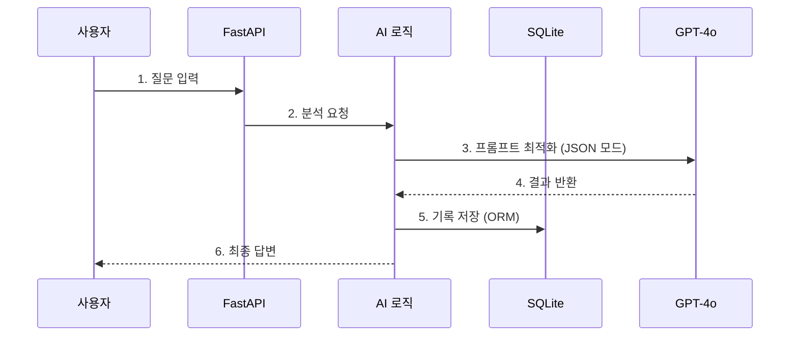
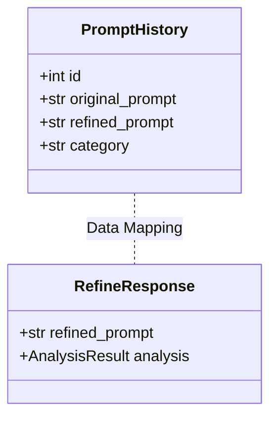

# FastAPI 프롬프트 리파이너 개발 과정 발표 자료

이 문서는 친구분이 PPT를 제작할 수 있도록 프로젝트의 핵심 내용, 기술적 의사결정, 그리고 구체적인 구현 코드를 상세하게 정리한 자료입니다.

---

## 1. 프로젝트 개요

### 1.1. 주제 선정 배경
*   **문제점**: 생성형 AI(ChatGPT 등)를 사용할 때, 사용자가 단순하게 질문하면 AI도 단순하고 일반적인 답변만 내놓는 "Garbage In, Garbage Out" 문제가 발생함.
*   **니즈**: 일반 사용자도 프롬프트 엔지니어링 지식 없이 전문가 수준(고퀄리티 영상 생성, 심층 데이터 분석 등)의 결과를 얻고 싶어 함.

### 1.2. 프로젝트 목표
*   **"AI Prompt Refiner"**: 사용자의 모호한 요청을 입력받아, 특정 도메인(영상, 데이터, 코딩 등)의 전문가 페르소나를 입힌 **최적화된 프롬프트**로 변환해주는 미들웨어 서비스 개발.

---

## 2. 기술 스택 선정 이유 (Why FastAPI?)

초기에는 **Next.js**를 고려했으나, 팀의 상황과 프로젝트 특성을 고려하여 **FastAPI**로 최종 결정했습니다.

| 구분 | 변경 전 (Next.js) | **변경 후 (FastAPI)** | **선정 이유 (핵심)** |
| :--- | :--- | :--- | :--- |
| **언어** | TypeScript | **Python** | 팀원 대부분이 TypeScript 경험이 없고, **Python이 공통적으로 익숙한 언어**였음. |
| **성능** | - | **비동기 (Async)** | Python의 속도 한계를 FastAPI의 강력한 **비동기 처리**로 극복 가능. |
| **연동** | - | **OpenAI & JSON** | OpenAI API 연동이 매우 쉽고, **JSON 데이터의 송수신 및 객체 변환(Pydantic)**이 직관적임. |

---

## 3. 4주간의 개발 스토리 (Development Timeline)

프로젝트는 크게 **DB 도입 전(1~2주차)**과 **DB 도입 후(3~4주차)**로 나뉩니다.

### 3.1. Phase 1: 핵심 기능 구현 (1~2주차) - "DB 없이 가볍게"
처음 2주 동안은 데이터베이스 없이, 순수하게 **OpenAI API 연동과 프롬프트 최적화**에만 집중했습니다.

*   **목표**: 사용자의 입력을 받아 AI가 다듬어주는 기본 기능(MVP) 완성.
*   **구현 내용**:
    *   FastAPI 서버 구축 및 OpenAI API 연결.
    *   **JSON 처리**: 프론트엔드에서 JSON으로 요청을 보내면, 백엔드에서 Pydantic 객체로 받아 처리하고 다시 JSON으로 반환하는 구조 확립.
    *   **한계점 발견**: 사용자들이 어떤 질문을 많이 하는지(통계) 알 수 없고, 지난 기록을 볼 수 없어 불편함.

### 3.2. Phase 2: 기능 확장 및 DB 도입 (3~4주차) - "데이터의 필요성"
단순 변환을 넘어, **사용자 패턴 분석(통계)**과 **기록 저장**을 위해 데이터베이스 도입을 결정했습니다.

*   **기술적 챌린지 (SQL Phobia)**:
    *   팀원들이 SQL 쿼리(`SELECT * FROM...`)에 익숙하지 않고, 거창한 DB 서버(MySQL 등)를 설치하는 것이 부담스러웠음.
*   **해결책 (SQLite & ORM)**:
    *   **SQLite**: 별도 설치 없이 내장된 파일 DB 사용.
    *   **ORM (SQLAlchemy)**: SQL 언어를 몰라도 **Python 객체 다루듯이 DB를 조작**할 수 있다는 점이 결정적이었음.
*   **구현 결과**:
    *   **통계 기능**: "사람들이 어떤 종류(코딩, 영상, 작문)의 질문을 많이 하는가?"를 시각화.
    *   **히스토리**: 과거 변환 기록 저장 및 조회 기능 추가.

### 3.3. UI 개발 스토리 (Frontend Strategy)
백엔드 개발자 관점에서 **"가장 효율적이고 빠른 UI 구축"**을 목표로 했습니다.

*   **No Framework (Vanilla JS)**: React나 Vue 같은 무거운 프레임워크 대신, **순수 HTML/JS**를 사용하여 복잡한 빌드 과정 없이 즉시 수정 및 배포가 가능하게 했습니다.
*   **Tailwind CSS (CDN)**: CSS 파일을 따로 관리하는 번거로움을 없애기 위해, CDN 방식의 Tailwind를 사용하여 HTML 내에서 빠르게 스타일링을 적용했습니다.
*   **비동기 통신 (Fetch API)**: 페이지 새로고침 없이 부드러운 사용자 경험(UX)을 제공하기 위해, `async/await`와 `fetch`를 사용하여 FastAPI와 비동기로 데이터를 주고받았습니다.

### 3.4. 개발 환경 및 도구 (Environment & Tools)
개발 과정에서 사용한 주요 도구들입니다.

*   **협업 및 버전 관리**: Git, GitHub (팀원 간 코드 공유)
*   **개발 환경**: VS Code, Python 3.10+, Poetry (패키지 관리)
*   **테스트 도구**: Swagger UI (API 문서 자동화 및 테스트), Postman
*   **커뮤니케이션**: Notion (기획 문서 정리), Discord

### 3.4. 시스템 아키텍처 및 클래스 다이어그램
말로만 설명하기보다, 실제 구조를 그림으로 정리했습니다.

**[시스템 아키텍처]**


**[클래스 다이어그램 (Backend)]**


### 3.5. 핵심 트러블 슈팅 (Key Challenges)
*   **JSON 파싱 에러**: AI가 가끔 줄글로 답해서 에러 발생 -> OpenAI `json_object` 모드로 강제하여 해결.
*   **API Key 보안**: 깃허브에 키가 올라가지 않도록 `config.json` 분리 및 `.gitignore` 적용.

---

## 4. 최종 프로젝트 구조 (Modular Architecture)
마지막 주차에는 유지보수를 위해 코드를 모듈별로 정리(Refactoring)했습니다.

```text
📦 fastapi-project
 ┣ 📂 app
 ┃ ┣ 📂 routers      # API 라우팅 (Endpoint)
 ┃ ┣ 📂 models       # DB 모델 (ORM)
 ┃ ┣ 📂 schemas      # 데이터 검증 (Pydantic)
 ┃ ┣ 📂 services     # AI 비즈니스 로직
 ┃ ┗ 📂 database     # DB 설정
 ┣ 📂 templates      # UI (HTML)
 ┗ 📜 config.json    # 설정 파일
```

---

## 5. 향후 발전 과제 (Future Roadmap)

이 프로젝트에서 **데이터를 저장하기 시작한 진짜 이유**는 미래를 위해서입니다.

*   **현재의 한계**: 고성능 AI(GPT-4)는 유료이고 비쌈. 무료 로컬 모델(Llama 등)은 성능이 낮음.
*   **빅픽처 (Fine-tuning)**:
    *   지금 DB에 차곡차곡 쌓이고 있는 **"원본 질문 -> 전문가가 다듬은 프롬프트"** 데이터 쌍이 핵심 자산임.
    *   나중에 이 데이터를 활용해 **작고 가벼운 무료 로컬 모델을 미세조정(Fine-tuning)**한다면,
    *   비싼 API 비용 없이도 우리만의 **"프롬프트 전문 소형 AI"**를 만들 수 있을 것임.

---

## 6. 핵심 기능 시연 (Demo)

1.  **입력**: "판다 영상" (단순)
2.  **처리**: AI가 "Image" 카테고리로 분류 -> "영상 감독" 페르소나 적용.
3.  **결과**: "Cinematic 4k shot..." (전문가 수준 변환)
4.  **확인**: `My Info` 페이지에서 방금 변환한 기록과, "Image" 카테고리 통계 수치가 올라간 것을 확인.
