# 📘 Study 1: 백엔드 개발 기초 (Linux, 언어/OS 선택)

**학습 목표**: 백엔드 개발자가 되기 위한 필수 기초 지식

---

## 📖 목차

1. [Linux 기초](#1-linux-기초)
2. [올바른 프로그래밍 언어 선택](#2-올바른-프로그래밍-언어-선택)
3. [올바른 OS 선택](#3-올바른-os-선택)
4. [문제 정의](#4-문제-정의)
5. [실습 예제](#5-실습-예제)

---

## 1. Linux 기초

### 왜 백엔드 개발자는 Linux를 알아야 할까?

**실전 이유**:
- 대부분의 서버는 Linux 기반 (AWS, Azure, GCP 모두)
- Docker 컨테이너가 Linux 기반
- 배포, 모니터링, 디버깅 모두 Linux 환경

### 필수 Linux 명령어

#### 파일 시스템 탐색
```bash
# 현재 위치 확인
pwd

# 폴더 내용 보기
ls -la

# 폴더 이동
cd /home/user/project

# 상위 폴더로
cd ..

# 파일/폴더 생성
mkdir my_project
touch app.py

# 파일/폴더 삭제
rm file.txt
rm -rf folder/  # 폴더 전체 삭제 (조심!)

# 파일 복사/이동
cp file1.txt file2.txt
mv old.txt new.txt
```

#### 파일 내용 보기
```bash
# 전체 내용
cat main.py

# 페이지 단위로
less logs.txt

# 처음 10줄
head -n 10 app.log

# 마지막 10줄 (로그 볼 때 유용!)
tail -n 10 app.log

# 실시간 로그 보기 (필수!)
tail -f /var/log/app.log
```

#### 프로세스 관리
```bash
# 실행 중인 프로세스 보기
ps aux | grep python

# 프로세스 죽이기
kill -9 [PID]

# 시스템 리소스 모니터링
top
htop  # 더 보기 좋음

# 포트 사용 확인 (서버 디버깅 필수!)
netstat -tulpn | grep 8000
lsof -i :8000
```

#### 권한 관리
```bash
# 권한 보기
ls -l

# 권한 변경
chmod 755 script.sh  # rwxr-xr-x
chmod +x run.sh      # 실행 권한 추가

# 소유자 변경
chown user:group file.txt
```

#### 검색
```bash
# 파일 찾기
find . -name "*.py"
find /var/log -name "*.log" -mtime -7  # 7일 이내 수정된 로그

# 내용 검색 (grep - 필수!)
grep "error" app.log
grep -r "TODO" .  # 재귀 검색
grep -i "warning" logs.txt  # 대소문자 무시
```

#### 네트워크
```bash
# 서버 접속 가능 확인
ping google.com

# HTTP 요청
curl http://localhost:8000/api/users
curl -X POST -H "Content-Type: application/json" -d '{"name":"홍길동"}' http://localhost:8000/users

# 다운로드
wget https://example.com/file.zip
```

### Python 예제: Linux 명령어 실행

```python
"""
subprocess로 Linux 명령어 실행하기

🔗 공식 문서: https://docs.python.org/3/library/subprocess.html
"""

import subprocess

# [방법 1] 간단한 명령어 실행
def run_command_simple():
    """ls -la 명령어 실행"""
    result = subprocess.run(
        ["ls", "-la"],  # 명령어를 리스트로
        capture_output=True,  # 출력 캡처
        text=True  # 문자열로 받기
    )
    
    print(result.stdout)  # 표준 출력
    print(result.stderr)  # 에러 출력
    print(f"Exit code: {result.returncode}")  # 0이면 성공

# [방법 2] 쉘 명령어 실행 (파이프 등)
def run_shell_command():
    """ps aux | grep python 같은 명령어"""
    result = subprocess.run(
        "ps aux | grep python",
        shell=True,  # 쉘 사용
        capture_output=True,
        text=True
    )
    print(result.stdout)

# [방법 3] 실시간 출력
def run_with_realtime_output():
    """로그를 실시간으로 보기"""
    process = subprocess.Popen(
        ["tail", "-f", "/var/log/app.log"],
        stdout=subprocess.PIPE,
        stderr=subprocess.PIPE,
        text=True
    )
    
    # 실시간 출력
    for line in process.stdout:
        print(line, end='')

# [실전 예제] 서버 상태 체크
def check_server_status():
    """FastAPI 서버가 실행 중인지 확인"""
    result = subprocess.run(
        ["lsof", "-i", ":8000"],
        capture_output=True,
        text=True
    )
    
    if result.returncode == 0:
        print("✅ 서버 실행 중")
        print(result.stdout)
    else:
        print("❌ 서버 미실행")
```

---

## 2. 올바른 프로그래밍 언어 선택

### 백엔드 언어 비교

#### Python (FastAPI, Django, Flask)
```python
# 장점
✅ 배우기 쉬움
✅ 라이브러리 풍부 (AI, 데이터 처리)
✅ 빠른 개발 속도

# 단점
⚠️ 상대적으로 느린 속도
⚠️ GIL (멀티스레드 제한)

# 언제 쓸까?
- 스타트업, MVP 개발
- AI/ML 백엔드
- 데이터 처리 서버
```

#### JavaScript/TypeScript (Node.js, Express, NestJS)
```javascript
// 장점
✅ 프론트엔드와 같은 언어
✅ 비동기 처리 강력
✅ 빠른 속도

// 단점
⚠️ 콜백 지옥 가능
⚠️ 타입 안정성 부족 (TS로 해결)

// 언제 쓸까?
- 실시간 채팅, WebSocket
- 풀스택 개발
- API Gateway
```

#### Go (Gin, Echo)
```go
// 장점
✅ 매우 빠른 속도
✅ 동시성 처리 우수
✅ 컴파일 언어 (배포 간편)

// 단점
⚠️ 상대적으로 어려움
⚠️ 라이브러리 적음

// 언제 쓸까?
- 고성능 API 서버
- 마이크로서비스
- DevOps 도구
```

#### Java/Kotlin (Spring Boot)
```java
// 장점
✅ 안정성, 성능
✅ 대규모 엔터프라이즈
✅ 성숙한 생태계

// 단점
⚠️ 무겁고 복잡
⚠️ 개발 속도 느림

// 언제 쓸까?
- 대기업 시스템
- 금융, 은행 서버
- 레거시 유지보수
```

### 선택 가이드

```mermaid
flowchart TD
    A[백엔드 언어 선택] --> B{빠른 개발?}
    B -->|Yes| C[Python]
    B -->|No| D{고성능 필요?}
    D -->|Yes| E[Go]
    D -->|No| F{프론트엔드와 통합?}
    F -->|Yes| G[TypeScript]
    F -->|No| H{대규모 엔터프라이즈?}
    H -->|Yes| I[Java]
    H -->|No| C
```



---

## 3. 올바른 OS 선택

### Linux 배포판 비교

#### Ubuntu (추천!)
```bash
# 장점
✅ 초보자 친화적
✅ 풍부한 문서
✅ LTS 지원 (5년)

# 용도
- 개발 서버
- 일반 목적 서버
- 학습용
```

#### CentOS/Rocky Linux
```bash
# 장점
✅ 안정성 (RedHat 기반)
✅ 엔터프라이즈 친화적

# 용도
- 대기업 서버
- 금융 시스템
```

#### Alpine Linux
```bash
# 장점
✅ 초경량 (5MB!)
✅ Docker 이미지에 최적

# 용도
- Docker 컨테이너
- 마이크로서비스
```

### Docker에서 OS 선택 예제

```dockerfile
# [방법 1] Ubuntu 기반
FROM ubuntu:22.04

RUN apt-get update && apt-get install -y python3

# [방법 2] Alpine 기반 (경량)
FROM python:3.12-alpine

# 이미지 크기 비교
# Ubuntu: ~200MB
# Alpine: ~50MB
```

---

## 4. 문제 정의

### 좋은 문제 정의의 조건

**SMART 원칙**:
- **S**pecific: 구체적
- **M**easurable: 측정 가능
- **A**chievable: 달성 가능
- **R**elevant: 관련있는
- **T**ime-bound: 기한 있는

**나쁜 예**:
```
"사용자 관리 시스템 만들기"
```

**좋은 예**:
```
목표: 회원가입/로그인 API 구현
기능:
  1. POST /api/register - 회원가입
  2. POST /api/login - 로그인 (JWT 발급)
  3. GET /api/me - 내 정보 조회
성능: 초당 1000 요청 처리
기한: 2주
```

---

## 5. 실습 예제

### Linux 환경 설정 스크립트

```python
"""
setup.py - 백엔드 개발 환경 자동 설정

실행: python3 setup.py
"""

import subprocess
import sys
import os

def run_cmd(cmd):
    """명령어 실행 헬퍼"""
    print(f"실행: {cmd}")
    result = subprocess.run(cmd, shell=True, capture_output=True, text=True)
    if result.returncode != 0:
        print(f"❌ 에러: {result.stderr}")
        return False
    print(f"✅ 성공: {result.stdout}")
    return True

def check_python():
    """Python 버전 확인"""
    print("🔍 Python 버전 확인...")
    result = subprocess.run(["python3", "--version"], capture_output=True, text=True)
    print(f"   {result.stdout.strip()}")
    
def install_dependencies():
    """필수 패키지 설치"""
    print("\n📦 패키지 설치 중...")
    
    packages = [
        "git",
        "curl",
        "vim",
        "htop",
        "python3-pip"
    ]
    
    for pkg in packages:
        run_cmd(f"sudo apt-get install -y {pkg}")

def setup_fastapi_project():
    """FastAPI 프로젝트 초기화"""
    print("\n🚀 FastAPI 프로젝트 설정...")
    
    # Poetry 설치
    run_cmd("curl -sSL https://install.python-poetry.org | python3 -")
    
    # 프로젝트 생성
    run_cmd("poetry new my_backend")
    
    os.chdir("my_backend")
    
    # FastAPI 설치
    run_cmd("poetry add fastapi uvicorn sqlalchemy pydantic")

def main():
    print("=" * 50)
    print("백엔드 개발 환경 자동 설정")
    print("=" * 50)
    
    check_python()
    install_dependencies()
    setup_fastapi_project()
    
    print("\n✅ 설정 완료!")
    print("다음 명령어로 서버 실행:")
    print("  cd my_backend")
    print("  poetry run uvicorn main:app --reload")

if __name__ == "__main__":
    main()
```

---

## 📚 추가 학습 자료

### Linux
- [Linux Journey](https://linuxjourney.com/) - 초보자용 대화형 튜토리얼
- [The Linux Command Line](https://linuxcommand.org/tlcl.php) - 무료 전자책
- [explainshell.com](https://explainshell.com/) - 명령어 설명

### 프로그래밍 언어
- [Python 공식 문서](https://docs.python.org/3/)
- [Real Python](https://realpython.com/) - Python 튜토리얼
- [Go by Example](https://gobyexample.com/) - Go 예제

### OS
- [Linux From Scratch](https://www.linuxfromscratch.org/) - Linux 빌드 학습

---

**다음 학습**: [study2.md - 설계 프로세스 & 디자인 패턴](./study2.md)
