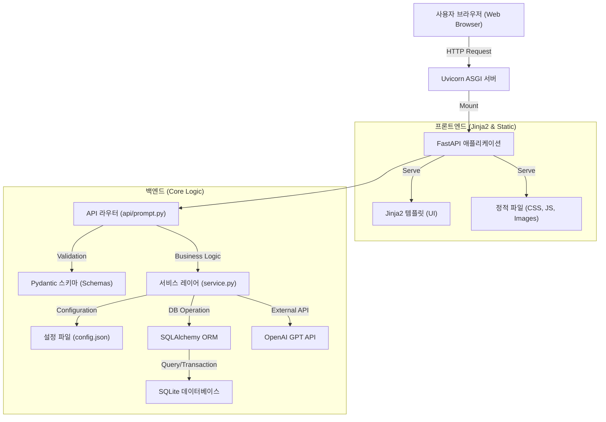
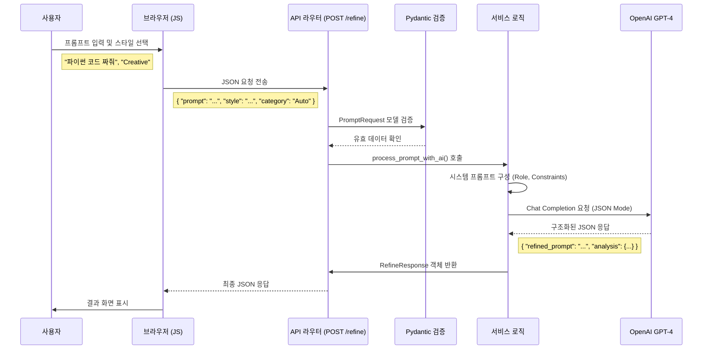
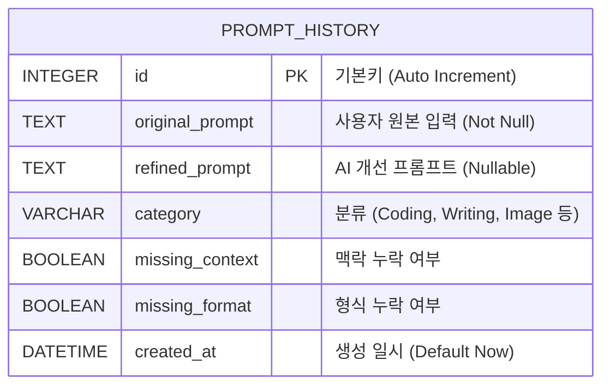
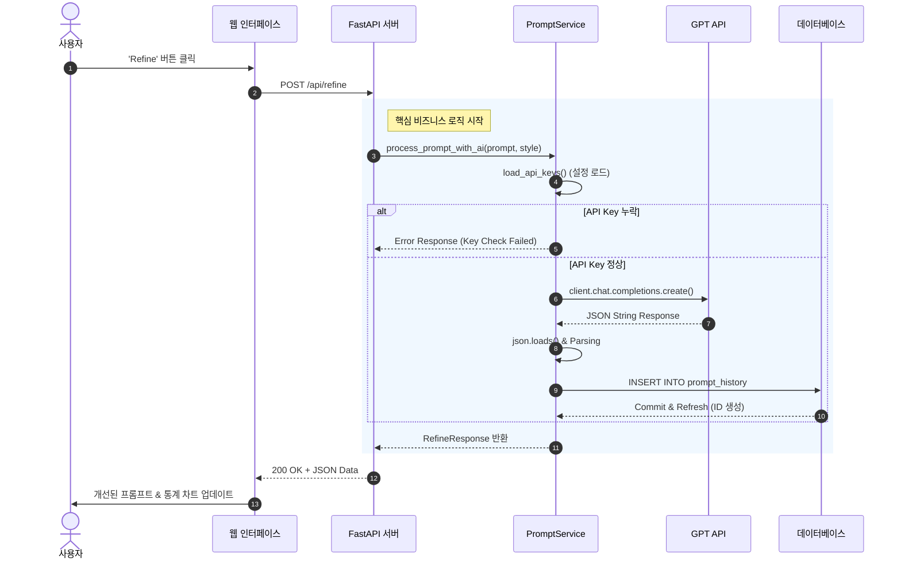
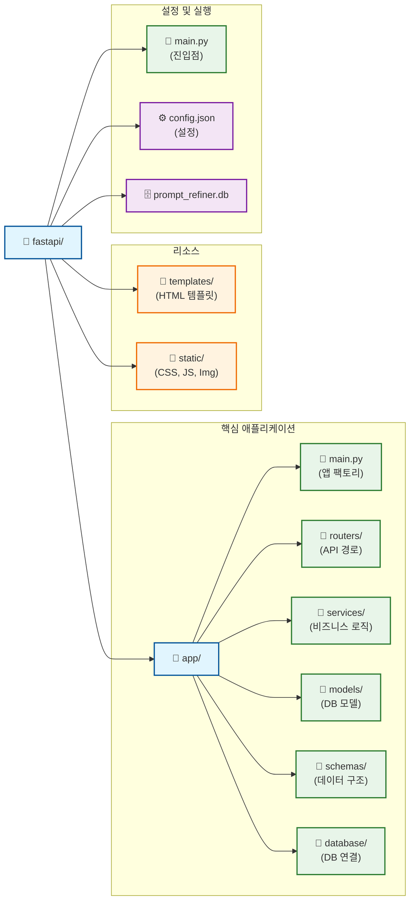

# Refine AI 기술 다이어그램 (상세본)

주피터 노트북에서 바로 사용할 수 있는 상세한 Mermaid 다이어그램 코드입니다.

## 1. 전체 시스템 아키텍처 (Architecture Overview)
Refine AI 시스템의 상세 구성요소 및 데이터 흐름을 보여줍니다.

## 2. API 데이터 흐름도 (API Flow Diagram)
프롬프트 개선 요청 시 데이터가 각 계층을 통과하며 변환되는 과정입니다.

## 3. 데이터베이스 설계도 (ER D, Entity-Relationship Diagram)
프롬프트 히스토리 저장을 위한 `prompt_history` 테이블 상세 구조입니다.

## 4. 시퀀스 다이어그램 (Sequence Diagram - 상세 처리 로직)
서비스 내부에서 일어나는 상세 처리 순서입니다.

## 5. 프로젝트 파일 구조도 (Project File Structure)
현재 프로젝트의 실제 디렉토리 구조입니다.

